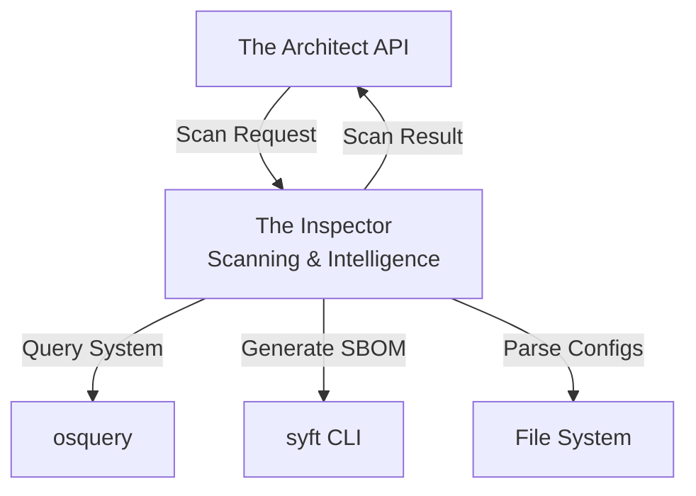

# Design Document: Scanning & Intelligence (Inspector)

## Overview

The Inspector is the scanning and intelligence component of DevReady, responsible for collecting comprehensive environment data from the host system. It acts as the data collection layer that feeds The Architect's API with accurate, structured information about installed tools, project dependencies, AI agent configurations, and system state.

This component operates 100% offline, completing full environment scans in under 8 seconds while supporting multiple tech stacks (Node.js, Python, Go, Rust, Java, etc.). It uses osquery for system-level queries, syft for dependency SBOM generation, and custom parsers for AI agent configuration files. All data is returned as dictionaries matching The Architect's Pydantic schemas, ensuring type safety and validation across the system.

The architecture prioritizes:
- **Speed**: Sub-8-second full scans with intelligent caching
- **Accuracy**: Precise detection of tools, versions, and dependencies
- **Offline Operation**: No network requests, all scanning is local
- **Extensibility**: Easy to add new tech stacks and scanners

## Architecture

### System Context



### Component Architecture

```mermaid
graph TB
    subgraph "Scan Orchestration"
        ScanOrchestrator[Scan Orchestrator]
        CacheManager[Cache Manager]
        PerformanceMonitor[Performance Monitor]
    end
    
    subgraph "System Scanning"
        SystemScanner[System Scanner]
        ToolDetector[Tool Detector]
        EnvCollector[Env Collector]
    end
    
    subgraph "Dependency Scanning"
        DependencyScanner[Dependency Scanner]
        SBOMParser[SBOM Parser]
        FreshnessAnalyzer[Freshness Analyzer]
    end
    
    subgraph "Config Scanning"
        ConfigParser[Config Parser]
        AIParser[AI Parser]
        PolicyChecker[Policy Checker]
    end
    
    subgraph "Project Detection"
        RootDetector[Root Detector]
        StackDetector[Stack Detector]
        ContextDetector[Context Detector]
    end
    
    subgraph "Infrastructure"
        SubprocessWrapper[Subprocess Wrapper]
        PathHandler[Path Handler]
        ResultValidator[Result Validator]
    end
    
    ScanOrchestrator --> SystemScanner
    ScanOrchestrator --> DependencyScanner
    ScanOrchestrator --> ConfigParser
    ScanOrchestrator --> RootDetector
    
    SystemScanner --> ToolDetector
    SystemScanner --> EnvCollector
    
    DependencyScanner --> SBOMParser
    DependencyScanner --> FreshnessAnalyzer
    
    ConfigParser --> AIParser
    ConfigParser --> PolicyChecker
    
    RootDetector --> StackDetector
    
    ScanOrchestrator --> CacheManager
    ScanOrchestrator --> PerformanceMonitor
    
    SystemScanner --> SubprocessWrapper
    DependencyScanner --> SubprocessWrapper
    
    All --> PathHandler
    ScanOrchestrator --> ResultValidator
```



### Technology Stack

- **System Queries**: osquery-python 3.0+ (SQL interface to OS state)
- **SBOM Generation**: syft CLI (via subprocess, JSON output)
- **Subprocess Management**: sh 2.0+ (Python subprocess wrapper)
- **Policy Validation**: Checkov 3.0+ (policy as code)
- **File Parsing**: Python stdlib (pathlib, json, toml, yaml)
- **Performance**: time, psutil (timing and caching)

### Deployment Model

The Inspector runs as a library within the DevReady daemon:
- Invoked by The Architect when scans are requested
- Returns structured dictionaries matching Pydantic schemas
- Caches expensive operations for performance
- Logs all scanning operations for debugging

## Components and Interfaces

### 1. Scan Orchestrator

**Responsibility**: Coordinate all scanning components and assemble results

**Key Class**:
```python
class ScanOrchestrator:
    def __init__(self):
        self.system_scanner = SystemScanner()
        self.dependency_scanner = DependencyScanner()
        self.config_parser = ConfigParser()
        self.root_detector = RootDetector()
        self.cache_manager = CacheManager()
        self.performance_monitor = PerformanceMonitor()
    
    async def scan(
        self,
        project_path: Optional[Path] = None,
        scope: ScanScope = ScanScope.FULL
    ) -> Dict[str, Any]:
        """
        Orchestrate full or partial scan.
        Returns dictionary matching EnvironmentSnapshot schema.
        """
        start_time = time.time()
        
        # Detect project context
        project_root = self.root_detector.detect(project_path or Path.cwd())
        tech_stack = self.root_detector.detect_tech_stack(project_root)
        
        # Execute scanners in parallel
        results = await asyncio.gather(
            self.system_scanner.scan() if scope.includes_system else None,
            self.dependency_scanner.scan(project_root) if scope.includes_dependencies else None,
            self.config_parser.scan(project_root) if scope.includes_configs else None,
        )
        
        # Assemble scan result
        scan_result = {
            "timestamp": datetime.utcnow().isoformat(),
            "project_path": str(project_root),
            "project_name": project_root.name,
            "tech_stack": tech_stack,
            "tools": results[0] if results[0] else [],
            "dependencies": results[1] if results[1] else {},
            "ai_configs": results[2] if results[2] else [],
            "scan_duration_seconds": time.time() - start_time,
        }
        
        # Validate against schema
        self.result_validator.validate(scan_result)
        
        return scan_result
```

**Scan Scopes**:
- `FULL`: All scanners (system + dependencies + configs)
- `SYSTEM_ONLY`: System scanner and tool detector only
- `DEPENDENCIES_ONLY`: Dependency scanner only
- `CONFIGS_ONLY`: Config parser and AI parser only

### 2. System Scanner

**Responsibility**: Query system-level state using osquery

**Key Methods**:
```python
class SystemScanner:
    def __init__(self):
        self.osquery_client = osquery.ExtensionClient()
    
    async def scan(self) -> List[Dict[str, Any]]:
        """Scan system for installed tools and packages."""
        tools = []
        
        # Query installed packages
        packages = await self._query_packages()
        tools.extend(self._parse_packages(packages))
        
        # Query listening ports
        ports = await self._query_ports()
        
        # Query OS version
        os_info = await self._query_os_info()
        
        return tools
    
    async def _query_packages(self) -> List[Dict]:
        """Query osquery for installed packages."""
        query = """
        SELECT name, version, source
        FROM packages
        WHERE source IN ('brew', 'apt', 'yum', 'chocolatey', 'winget')
        """
        return self.osquery_client.query(query)
    
    async def _query_ports(self) -> List[Dict]:
        """Query osquery for listening ports."""
        query = """
        SELECT port, process_name, pid
        FROM listening_ports
        WHERE address = '0.0.0.0' OR address = '127.0.0.1'
        """
        return self.osquery_client.query(query)
    
    async def _query_os_info(self) -> Dict:
        """Query osquery for OS version and architecture."""
        query = """
        SELECT name, version, arch
        FROM os_version
        """
        result = self.osquery_client.query(query)
        return result[0] if result else {}
```

**Package Manager Detection**:
- macOS: brew (Homebrew)
- Ubuntu/Debian: apt
- RHEL/CentOS: yum, dnf
- Fedora: dnf
- Arch: pacman
- Windows: chocolatey, winget, scoop

### 3. Tool Detector

**Responsibility**: Detect versions of common development tools

**Key Methods**:
```python
class ToolDetector:
    TOOLS = {
        "node": {"command": "node --version", "pattern": r"v(\d+\.\d+\.\d+)"},
        "python": {"command": "python --version", "pattern": r"Python (\d+\.\d+\.\d+)"},
        "go": {"command": "go version", "pattern": r"go(\d+\.\d+\.\d+)"},
        "rustc": {"command": "rustc --version", "pattern": r"rustc (\d+\.\d+\.\d+)"},
        "java": {"command": "java -version", "pattern": r'version "(\d+\.\d+\.\d+)"'},
        "docker": {"command": "docker --version", "pattern": r"Docker version (\d+\.\d+\.\d+)"},
        "git": {"command": "git --version", "pattern": r"git version (\d+\.\d+\.\d+)"},
    }
    
    async def detect_all(self) -> List[ToolVersion]:
        """Detect all common tools."""
        results = await asyncio.gather(*[
            self.detect_tool(name, config)
            for name, config in self.TOOLS.items()
        ])
        return [r for r in results if r is not None]
    
    async def detect_tool(self, name: str, config: Dict) -> Optional[ToolVersion]:
        """Detect a single tool version."""
        try:
            result = await self.subprocess_wrapper.execute(
                config["command"],
                timeout=1.0
            )
            
            if result.exit_code != 0:
                return None
            
            # Parse version from output
            match = re.search(config["pattern"], result.stdout)
            if not match:
                return None
            
            version = match.group(1)
            path = await self._find_tool_path(name)
            manager = await self._detect_version_manager(name, path)
            
            return ToolVersion(
                name=name,
                version=version,
                path=str(path),
                manager=manager
            )
        except subprocess.TimeoutExpired:
            return None
    
    async def _detect_version_manager(self, tool: str, path: Path) -> Optional[str]:
        """Detect which version manager controls this tool."""
        # Check for nvm (Node.js)
        if tool == "node" and ".nvm" in str(path):
            return "nvm"
        
        # Check for pyenv (Python)
        if tool == "python" and ".pyenv" in str(path):
            return "pyenv"
        
        # Check for asdf (multi-language)
        if ".asdf" in str(path):
            return "asdf"
        
        # Check for mise (multi-language)
        if ".mise" in str(path) or ".rtx" in str(path):
            return "mise"
        
        # Check for rustup (Rust)
        if tool == "rustc" and ".rustup" in str(path):
            return "rustup"
        
        return None
```

### 4. Dependency Scanner

**Responsibility**: Generate SBOM using syft and parse dependencies

**Key Methods**:
```python
class DependencyScanner:
    async def scan(self, project_root: Path) -> Dict[str, List[str]]:
        """Scan project dependencies using syft."""
        # Execute syft to generate SBOM
        result = await self.subprocess_wrapper.execute(
            f"syft {project_root} -o json",
            timeout=4.0
        )
        
        if result.exit_code != 0:
            raise ScanError(f"syft failed: {result.stderr}")
        
        # Parse SBOM JSON
        sbom = json.loads(result.stdout)
        dependencies = self.sbom_parser.parse(sbom)
        
        return dependencies
    
    def _check_syft_installed(self) -> bool:
        """Check if syft is installed."""
        try:
            result = subprocess.run(
                ["syft", "--version"],
                capture_output=True,
                timeout=1.0
            )
            return result.returncode == 0
        except (FileNotFoundError, subprocess.TimeoutExpired):
            return False
```

**SBOM Parser**:
```python
class SBOMParser:
    def parse(self, sbom: Dict) -> Dict[str, List[str]]:
        """Parse syft SBOM JSON into dependencies dict."""
        dependencies = {}
        
        for artifact in sbom.get("artifacts", []):
            pkg_type = artifact.get("type", "unknown")
            name = artifact.get("name")
            version = artifact.get("version")
            
            if pkg_type not in dependencies:
                dependencies[pkg_type] = []
            
            dependencies[pkg_type].append(f"{name}@{version}")
        
        return dependencies
    
    def pretty_print(self, dependencies: Dict[str, List[str]]) -> str:
        """Format dependencies for human-readable output."""
        lines = []
        for pkg_type, packages in dependencies.items():
            lines.append(f"\n{pkg_type.upper()}:")
            for pkg in sorted(packages):
                lines.append(f"  - {pkg}")
        return "\n".join(lines)
```

### 5. Config Parser

**Responsibility**: Parse AI agent configuration files

**Key Methods**:
```python
class ConfigParser:
    CONFIG_FILES = [
        "CLAUDE.md",
        ".cursorrules",
        ".copilot",
        "AGENTS.md",
        ".aider.conf.yml",
    ]
    
    async def scan(self, project_root: Path) -> List[Dict[str, Any]]:
        """Scan for AI agent config files."""
        configs = []
        
        for config_file in self.CONFIG_FILES:
            path = project_root / config_file
            if path.exists():
                config = await self._parse_config(path)
                configs.append(config)
        
        return configs
    
    async def _parse_config(self, path: Path) -> Dict[str, Any]:
        """Parse a single config file."""
        content = path.read_text()
        
        # Determine agent type from filename
        agent_type = self._detect_agent_type(path.name)
        
        # Parse based on file type
        if path.suffix == ".md":
            settings = self.ai_parser.parse_markdown(content)
        elif path.suffix in [".yml", ".yaml"]:
            settings = yaml.safe_load(content)
        elif path.suffix == ".json":
            settings = json.loads(content)
        else:
            settings = self.ai_parser.parse_text(content)
        
        return {
            "file_path": str(path),
            "agent_type": agent_type,
            "settings": settings,
            "last_modified": path.stat().st_mtime,
        }
```

**AI Parser**:
```python
class AIParser:
    def parse_markdown(self, content: str) -> Dict[str, Any]:
        """Parse markdown config files like CLAUDE.md."""
        settings = {}
        
        # Extract sections
        sections = self._split_sections(content)
        
        for section_name, section_content in sections.items():
            # Extract key-value pairs
            settings[section_name] = self._extract_settings(section_content)
        
        # Extract referenced files
        settings["referenced_files"] = self._extract_file_references(content)
        
        # Extract model preferences
        settings["model_preferences"] = self._extract_model_preferences(content)
        
        return settings
    
    def _extract_file_references(self, content: str) -> List[str]:
        """Extract file paths referenced in config."""
        # Match patterns like: #[[file:path/to/file.py]]
        pattern = r'#\[\[file:([^\]]+)\]\]'
        return re.findall(pattern, content)
    
    def _extract_model_preferences(self, content: str) -> Dict[str, Any]:
        """Extract model settings like temperature, max_tokens."""
        preferences = {}
        
        # Look for common patterns
        temp_match = re.search(r'temperature[:\s]+(\d+\.?\d*)', content, re.I)
        if temp_match:
            preferences["temperature"] = float(temp_match.group(1))
        
        tokens_match = re.search(r'max_tokens[:\s]+(\d+)', content, re.I)
        if tokens_match:
            preferences["max_tokens"] = int(tokens_match.group(1))
        
        return preferences
```

### 6. Project Root Detector

**Responsibility**: Detect project root and tech stack

**Key Methods**:
```python
class RootDetector:
    PROJECT_MARKERS = [
        ".git",
        "pyproject.toml",
        "package.json",
        "Cargo.toml",
        "go.mod",
        "pom.xml",
        "build.gradle",
    ]
    
    def detect(self, start_path: Path) -> Path:
        """Detect project root by searching for markers."""
        current = start_path.resolve()
        
        # Search up to 10 parent directories
        for _ in range(10):
            for marker in self.PROJECT_MARKERS:
                if (current / marker).exists():
                    return current
            
            parent = current.parent
            if parent == current:  # Reached filesystem root
                break
            current = parent
        
        # No marker found, use start path
        return start_path
    
    def detect_tech_stack(self, project_root: Path) -> str:
        """Detect programming language ecosystem."""
        if (project_root / "package.json").exists():
            return "nodejs"
        if (project_root / "pyproject.toml").exists() or (project_root / "setup.py").exists():
            return "python"
        if (project_root / "Cargo.toml").exists():
            return "rust"
        if (project_root / "go.mod").exists():
            return "go"
        if (project_root / "pom.xml").exists() or (project_root / "build.gradle").exists():
            return "java"
        
        return "unknown"
```

### 7. Policy Checker

**Responsibility**: Validate scanned data against team policies

**Key Methods**:
```python
class PolicyChecker:
    def check(self, scan_result: Dict, policy: Dict) -> List[Dict]:
        """Check scan result against team policy."""
        violations = []
        
        # Check required tools
        for required_tool in policy.get("required_tools", []):
            if not self._tool_present(scan_result, required_tool):
                violations.append({
                    "violation_type": "missing_tool",
                    "tool_or_var_name": required_tool["name"],
                    "expected": required_tool.get("min_version"),
                    "actual": None,
                    "severity": "error",
                    "message": f"Required tool {required_tool['name']} is not installed"
                })
        
        # Check version constraints
        for tool_name, constraint in policy.get("version_constraints", {}).items():
            actual_version = self._get_tool_version(scan_result, tool_name)
            if actual_version and not self._version_satisfies(actual_version, constraint):
                violations.append({
                    "violation_type": "version_mismatch",
                    "tool_or_var_name": tool_name,
                    "expected": constraint,
                    "actual": actual_version,
                    "severity": "error",
                    "message": f"{tool_name} version {actual_version} does not satisfy {constraint}"
                })
        
        # Check forbidden tools
        for forbidden_tool in policy.get("forbidden_tools", []):
            if self._tool_present(scan_result, {"name": forbidden_tool}):
                violations.append({
                    "violation_type": "forbidden_tool",
                    "tool_or_var_name": forbidden_tool,
                    "expected": None,
                    "actual": "installed",
                    "severity": "warning",
                    "message": f"Forbidden tool {forbidden_tool} is installed"
                })
        
        return violations
```

### 8. Subprocess Wrapper

**Responsibility**: Safe subprocess execution with timeouts

**Key Methods**:
```python
class SubprocessWrapper:
    async def execute(
        self,
        command: str,
        timeout: float = 5.0,
        cwd: Optional[Path] = None
    ) -> ExecutionResult:
        """Execute command with timeout and capture output."""
        start_time = time.time()
        
        try:
            # Sanitize command to prevent shell injection
            sanitized_command = self._sanitize_command(command)
            
            # Execute with timeout
            process = await asyncio.create_subprocess_shell(
                sanitized_command,
                stdout=asyncio.subprocess.PIPE,
                stderr=asyncio.subprocess.PIPE,
                cwd=cwd
            )
            
            stdout, stderr = await asyncio.wait_for(
                process.communicate(),
                timeout=timeout
            )
            
            return ExecutionResult(
                exit_code=process.returncode,
                stdout=stdout.decode(),
                stderr=stderr.decode(),
                duration_seconds=time.time() - start_time
            )
        
        except asyncio.TimeoutError:
            process.kill()
            await process.wait()
            raise SubprocessTimeoutError(f"Command timed out after {timeout}s: {command}")
        
        except Exception as e:
            raise SubprocessError(f"Command failed: {command}\nError: {str(e)}")
    
    def _sanitize_command(self, command: str) -> str:
        """Sanitize command to prevent shell injection."""
        # Remove dangerous characters
        dangerous_chars = [";", "&", "|", "`", "$", "(", ")", "<", ">"]
        for char in dangerous_chars:
            if char in command:
                raise ValueError(f"Dangerous character '{char}' in command")
        return command
```

### 9. Cache Manager

**Responsibility**: Cache expensive operations for performance

**Key Methods**:
```python
class CacheManager:
    def __init__(self):
        self.cache = {}
        self.cache_ttl = {
            "tool_versions": 300,  # 5 minutes
            "sbom": 60,  # 1 minute
        }
    
    def get(self, key: str) -> Optional[Any]:
        """Get cached value if not expired."""
        if key not in self.cache:
            return None
        
        entry = self.cache[key]
        if time.time() - entry["timestamp"] > self.cache_ttl.get(key.split(":")[0], 60):
            del self.cache[key]
            return None
        
        return entry["value"]
    
    def set(self, key: str, value: Any):
        """Cache value with timestamp."""
        self.cache[key] = {
            "value": value,
            "timestamp": time.time()
        }
    
    def invalidate(self, pattern: str):
        """Invalidate cache entries matching pattern."""
        keys_to_delete = [k for k in self.cache.keys() if pattern in k]
        for key in keys_to_delete:
            del self.cache[key]
```

### 10. Performance Monitor

**Responsibility**: Track scan performance and timing

**Key Methods**:
```python
class PerformanceMonitor:
    def __init__(self):
        self.timings = {}
    
    def start(self, operation: str):
        """Start timing an operation."""
        self.timings[operation] = {"start": time.time()}
    
    def end(self, operation: str):
        """End timing an operation."""
        if operation in self.timings:
            self.timings[operation]["duration"] = time.time() - self.timings[operation]["start"]
    
    def get_report(self) -> Dict[str, float]:
        """Get timing report."""
        return {op: data.get("duration", 0) for op, data in self.timings.items()}
    
    def check_budget(self, operation: str, budget_seconds: float) -> bool:
        """Check if operation exceeded time budget."""
        duration = self.timings.get(operation, {}).get("duration", 0)
        if duration > budget_seconds:
            logger.warning(f"{operation} exceeded budget: {duration:.2f}s > {budget_seconds}s")
            return False
        return True
```

## Data Models

### Core Domain Models

**ToolVersion** (Value Object):
```python
@dataclass(frozen=True)
class ToolVersion:
    name: str
    version: str
    path: str
    manager: Optional[str] = None
```

**ScanResult** (Aggregate):
```python
@dataclass
class ScanResult:
    timestamp: str
    project_path: str
    project_name: str
    tech_stack: str
    tools: List[ToolVersion]
    dependencies: Dict[str, List[str]]
    env_vars: Dict[str, str]
    ai_configs: List[Dict[str, Any]]
    scan_duration_seconds: float
    errors: List[str] = field(default_factory=list)
```

**ExecutionResult** (Value Object):
```python
@dataclass
class ExecutionResult:
    exit_code: int
    stdout: str
    stderr: str
    duration_seconds: float
```

## Correctness Properties

### Property 1: Scan Completeness
**Statement**: Full scans include all required data fields.
**Validation**: Test that scan results contain all EnvironmentSnapshot fields.

### Property 2: Scan Performance
**Statement**: Full scans complete within 8 seconds.
**Validation**: Property test that scan duration < 8 seconds for typical projects.

### Property 3: Tool Detection Accuracy
**Statement**: Detected tool versions match actual installed versions.
**Validation**: Test against known tool installations.

### Property 4: SBOM Parsing Round-Trip
**Statement**: Parsing syft output then pretty printing then parsing produces equivalent structure.
**Validation**: Property test for round-trip parsing.

### Property 5: Cache Correctness
**Statement**: Cached results are equivalent to fresh scans within TTL.
**Validation**: Test that cached and fresh results match.

### Property 6: Offline Operation
**Statement**: All scanning operations work without network access.
**Validation**: Test with network disabled.

### Property 7: Error Recovery
**Statement**: Scanner failures return partial results with error details.
**Validation**: Test that individual scanner failures don't crash orchestrator.

### Property 8: Cross-Platform Paths
**Statement**: Path handling works correctly on Windows, macOS, and Linux.
**Validation**: Test path normalization on all platforms.

## Performance Requirements

- Full scan: < 8 seconds
- System scan: < 2 seconds
- Dependency scan: < 4 seconds
- Config scan: < 1 second
- Tool detection: < 3 seconds
- Cache hit: < 10ms
- Project root detection: < 100ms

## Testing Strategy

- Unit tests for each scanner component
- Property tests for correctness properties
- Integration tests for full scan workflows
- Performance tests for timing requirements
- Cross-platform tests for path handling
- Offline tests to verify no network dependencies
