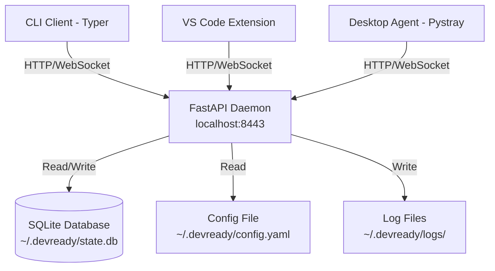
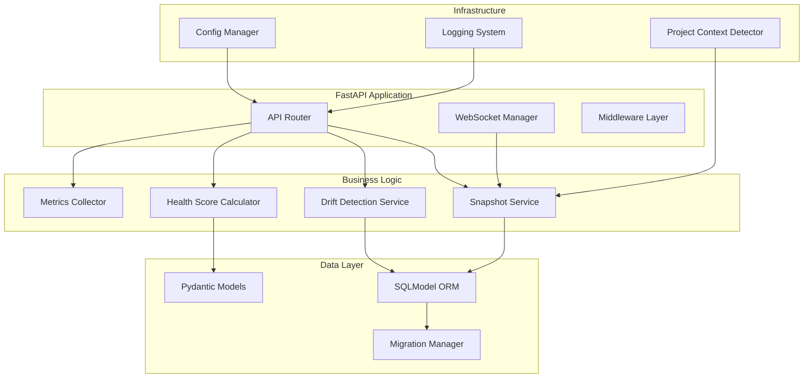
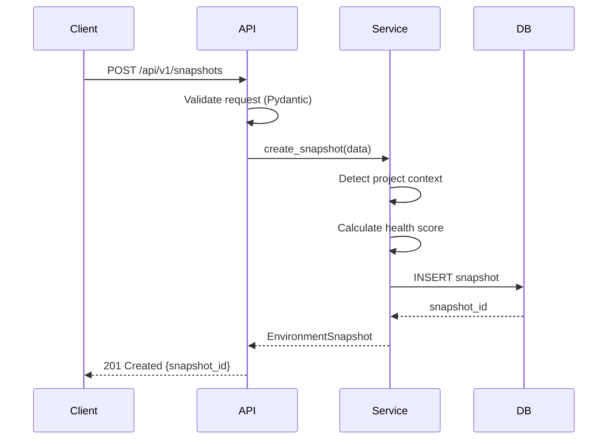

# Design Document: Core API & Data State (Architect)

## Overview

The Architect component is the foundational backend service for DevReady, implemented as a FastAPI daemon that runs locally on localhost:8443. It serves as the single source of truth for environment state management, providing REST and WebSocket APIs for scanning, snapshot management, drift detection, and health scoring.

This component is designed to be lightweight (< 2% CPU, < 150 MB RAM idle), fast (< 8 second full scans), and 100% local-first. It uses SQLite for persistence, Pydantic for data validation, and SQLModel for ORM capabilities. The daemon operates as a background service that multiple clients (CLI, VS Code extension, desktop agent) communicate with simultaneously.

The architecture prioritizes:
- **Performance**: Async I/O, efficient database queries, minimal memory footprint
- **Reliability**: Comprehensive error handling, automatic migrations, graceful degradation
- **Developer Experience**: Strong typing, clear API contracts, detailed logging
- **Security**: Localhost-only binding, input validation, rate limiting

## Architecture

### System Context



### Component Architecture



### Technology Stack

- **Web Framework**: FastAPI 0.110+ (async, automatic OpenAPI docs, dependency injection)
- **Data Validation**: Pydantic 2.6+ (type safety, JSON serialization, validation)
- **ORM**: SQLModel 0.0.16+ (combines SQLAlchemy + Pydantic)
- **Database**: SQLite 3.40+ (embedded, zero-config, ACID compliant)
- **Async Runtime**: asyncio + uvicorn (ASGI server)
- **Configuration**: PyYAML 6.0+ (YAML parsing)
- **Logging**: Python logging module with rotating file handlers

### Deployment Model

The daemon runs as a single-process background service:
- Started automatically on system boot (via systemd/launchd/Task Scheduler)
- Managed by the CLI (`devready daemon start|stop|restart|status`)
- Packaged as a standalone executable via PyInstaller
- No external dependencies required on target system

## Components and Interfaces

### 1. FastAPI Application Layer

**Responsibility**: HTTP server, routing, middleware, CORS, error handling

**Key Classes**:
- `DaemonApp`: Main FastAPI application instance
- `APIRouter`: Route definitions for /api/v1/* endpoints
- `WebSocketManager`: Manages WebSocket connections and broadcasts

**Configuration**:
```python
app = FastAPI(
    title="DevReady Daemon API",
    version="1.0.0",
    docs_url="/api/docs",
    redoc_url="/api/redoc"
)

# CORS for localhost only
app.add_middleware(
    CORSMiddleware,
    allow_origins=["http://localhost:*", "http://127.0.0.1:*"],
    allow_methods=["GET", "POST", "DELETE"],
    allow_headers=["*"]
)

# Rate limiting middleware
app.add_middleware(RateLimitMiddleware, max_requests=100, window_seconds=60)
```

**Startup/Shutdown Hooks**:
- `on_startup`: Initialize database, load config, start metrics collector
- `on_shutdown`: Close database connections, flush logs, cleanup resources

### 2. REST API Endpoints

**Base Path**: `/api/v1/`

**Snapshot Management**:
- `POST /api/v1/snapshots` - Create new snapshot
  - Request: `SnapshotCreateRequest` (tools, dependencies, env_vars, project_path)
  - Response: `SnapshotResponse` (201 Created, snapshot_id)
  - Timeout: 10 seconds
  
- `GET /api/v1/snapshots/{id}` - Retrieve snapshot by ID
  - Response: `SnapshotResponse` (200 OK) or 404 Not Found
  
- `GET /api/v1/snapshots?project_path={path}` - List snapshots for project
  - Response: `SnapshotListResponse` (200 OK, array of snapshots)
  
- `GET /api/v1/snapshots/latest?project_path={path}` - Get most recent snapshot
  - Response: `SnapshotResponse` (200 OK) or 404 Not Found
  
- `DELETE /api/v1/snapshots/{id}` - Delete snapshot
  - Response: 204 No Content or 404 Not Found

**Drift Detection**:
- `POST /api/v1/drift/compare` - Compare two snapshots
  - Request: `DriftCompareRequest` (snapshot_a_id, snapshot_b_id)
  - Response: `DriftReportResponse` (200 OK)
  
- `POST /api/v1/drift/policy` - Check policy compliance
  - Request: `PolicyCheckRequest` (snapshot_id, team_policy)
  - Response: `PolicyViolationsResponse` (200 OK)

**Metrics & Health**:
- `GET /api/v1/metrics` - Get daemon performance metrics
  - Response: `MetricsResponse` (cpu_percent, memory_mb, scan_count, avg_scan_duration)
  
- `GET /api/version` - Get API version info
  - Response: `VersionResponse` (api_version, daemon_version, build_number)

**Error Response Format**:
```json
{
  "error_code": "SNAPSHOT_NOT_FOUND",
  "message": "Snapshot with id abc123 does not exist",
  "details": {
    "snapshot_id": "abc123",
    "timestamp": "2026-04-08T10:30:00Z"
  }
}
```

### 3. WebSocket API

**Endpoint**: `/ws/scan`

**Protocol**: JSON messages over WebSocket

**Message Types**:

Progress Update:
```json
{
  "type": "progress",
  "stage": "scanning_tools",
  "percent_complete": 45,
  "current_tool": "node",
  "message": "Detecting Node.js versions..."
}
```

Completion:
```json
{
  "type": "complete",
  "snapshot_id": "abc123",
  "health_score": 87,
  "duration_seconds": 6.2
}
```

Error:
```json
{
  "type": "error",
  "error_code": "SCAN_FAILED",
  "message": "Failed to execute syft",
  "details": {"exit_code": 1}
}
```

**Connection Management**:
- Clients connect with query param: `/ws/scan?project_path=/path/to/project`
- Server maintains a registry of active connections
- Broadcasts are sent to all connected clients for the same project
- Automatic cleanup on disconnect

### 4. Data Models (Pydantic)

**ToolVersion**:
```python
class ToolVersion(BaseModel):
    name: str  # e.g., "node", "python", "go"
    version: str  # e.g., "20.11.0"
    path: str  # e.g., "/usr/local/bin/node"
    manager: Optional[str] = None  # e.g., "nvm", "mise", "asdf"
    
    model_config = ConfigDict(frozen=True)
```

**EnvironmentSnapshot**:
```python
class EnvironmentSnapshot(SQLModel, table=True):
    id: Optional[str] = Field(default_factory=lambda: str(uuid.uuid4()), primary_key=True)
    timestamp: datetime = Field(default_factory=datetime.utcnow)
    project_path: str = Field(index=True)
    project_name: str
    tools: List[ToolVersion] = Field(sa_column=Column(JSON))
    dependencies: Dict[str, List[str]] = Field(sa_column=Column(JSON))
    env_vars: Dict[str, str] = Field(sa_column=Column(JSON))
    health_score: int = Field(ge=0, le=100)
    scan_duration_seconds: float
    
    class Config:
        arbitrary_types_allowed = True
```

**DriftReport**:
```python
class DriftReport(BaseModel):
    snapshot_a_id: str
    snapshot_b_id: str
    timestamp: datetime = Field(default_factory=datetime.utcnow)
    added_tools: List[ToolVersion]
    removed_tools: List[ToolVersion]
    version_changes: List[VersionChange]
    drift_score: int = Field(ge=0, le=100)
    
class VersionChange(BaseModel):
    tool_name: str
    old_version: str
    new_version: str
    severity: Literal["major", "minor", "patch"]
```

**TeamPolicy**:
```python
class TeamPolicy(BaseModel):
    required_tools: List[ToolRequirement]
    forbidden_tools: List[str]
    version_constraints: Dict[str, str]  # tool_name -> semver constraint
    env_var_requirements: List[EnvVarRequirement]
    
class ToolRequirement(BaseModel):
    name: str
    min_version: Optional[str] = None
    max_version: Optional[str] = None
    allowed_managers: Optional[List[str]] = None
    
class EnvVarRequirement(BaseModel):
    name: str
    required: bool
    pattern: Optional[str] = None  # regex pattern for validation
```

**PolicyViolation**:
```python
class PolicyViolation(BaseModel):
    violation_type: Literal["missing_tool", "version_mismatch", "forbidden_tool", "missing_env_var"]
    tool_or_var_name: str
    expected: Optional[str] = None
    actual: Optional[str] = None
    severity: Literal["error", "warning"]
    message: str
```

### 5. Database Layer (SQLModel + SQLite)

**Database Location**: `~/.devready/state.db`

**Schema**:

```sql
CREATE TABLE environmentsnapshot (
    id TEXT PRIMARY KEY,
    timestamp DATETIME NOT NULL,
    project_path TEXT NOT NULL,
    project_name TEXT NOT NULL,
    tools JSON NOT NULL,
    dependencies JSON NOT NULL,
    env_vars JSON NOT NULL,
    health_score INTEGER NOT NULL CHECK(health_score >= 0 AND health_score <= 100),
    scan_duration_seconds REAL NOT NULL
);

CREATE INDEX idx_project_path ON environmentsnapshot(project_path);
CREATE INDEX idx_timestamp ON environmentsnapshot(timestamp);

CREATE TABLE schema_migrations (
    version INTEGER PRIMARY KEY,
    applied_at DATETIME NOT NULL,
    description TEXT NOT NULL
);
```

**Connection Management**:
```python
# Async SQLite connection with connection pooling
engine = create_async_engine(
    f"sqlite+aiosqlite:///{db_path}",
    echo=False,
    connect_args={"check_same_thread": False}
)

# Session factory with dependency injection
async def get_session() -> AsyncSession:
    async with AsyncSession(engine) as session:
        yield session
```

**Query Patterns**:
- Use SQLModel's async query API
- Implement pagination for list endpoints (limit=50 default)
- Use indexes for project_path and timestamp filters
- Implement soft deletes for audit trail (optional future enhancement)

### 6. Business Logic Services

**SnapshotService**:
- `create_snapshot(data: SnapshotCreateRequest) -> EnvironmentSnapshot`
- `get_snapshot(snapshot_id: str) -> Optional[EnvironmentSnapshot]`
- `list_snapshots(project_path: str, limit: int, offset: int) -> List[EnvironmentSnapshot]`
- `get_latest_snapshot(project_path: str) -> Optional[EnvironmentSnapshot]`
- `delete_snapshot(snapshot_id: str) -> bool`
- `cleanup_old_snapshots(retention_days: int) -> int`

**DriftDetectionService**:
- `compare_snapshots(a_id: str, b_id: str) -> DriftReport`
- `check_policy_compliance(snapshot_id: str, policy: TeamPolicy) -> List[PolicyViolation]`
- `calculate_drift_score(report: DriftReport) -> int`

**HealthScoreCalculator**:
- `calculate_score(snapshot: EnvironmentSnapshot, policy: Optional[TeamPolicy]) -> int`
- Scoring algorithm:
  - Start at 100
  - -10 points per missing required tool
  - -5 points per version mismatch
  - -3 points per outdated dependency with CVE
  - -2 points per missing recommended env var
  - Minimum score: 0

**MetricsCollector**:
- Runs background task every 5 seconds
- Collects: CPU%, memory MB, active connections, request count
- Stores in-memory circular buffer (last 1000 samples)
- Exposes via `/api/v1/metrics` endpoint

### 7. Configuration Management

**Config File**: `~/.devready/config.yaml`

**Default Configuration**:
```yaml
daemon:
  host: "127.0.0.1"
  port: 8443
  workers: 1
  
database:
  path: "~/.devready/state.db"
  retention_days: 90
  backup_enabled: true
  
logging:
  level: "INFO"  # DEBUG, INFO, WARN, ERROR
  file: "~/.devready/logs/daemon.log"
  max_size_mb: 10
  backup_count: 5
  
performance:
  max_concurrent_scans: 3
  request_timeout_seconds: 30
  rate_limit_per_minute: 100
```

**ConfigManager**:
- Loads config on startup
- Validates all values against allowed ranges
- Creates default config if missing
- Supports environment variable overrides (DEVREADY_PORT, etc.)

### 8. Project Context Detection

**ContextDetector**:
- Searches upward from working_directory for project markers
- Markers (in priority order):
  1. `.git` directory
  2. `pyproject.toml`
  3. `package.json`
  4. `Cargo.toml`
  5. `go.mod`
  6. `pom.xml`
  
- Extracts project name from:
  - Git remote URL
  - Package manifest name field
  - Directory name (fallback)
  
- Caches results per path to avoid repeated filesystem scans

### 9. Logging System

**Log Levels**:
- DEBUG: Detailed diagnostic info (SQL queries, request/response bodies)
- INFO: General operational events (startup, shutdown, scan completion)
- WARN: Recoverable errors (rate limit exceeded, config validation warnings)
- ERROR: Unrecoverable errors (database failures, critical exceptions)

**Log Format**:
```
2026-04-08 10:30:45.123 | INFO | daemon.api.snapshots | Created snapshot abc123 for project /path/to/project
2026-04-08 10:30:46.456 | ERROR | daemon.db.session | Database locked, retrying (attempt 2/3)
```

**Log Rotation**:
- Max file size: 10 MB
- Keep 5 historical files
- Compress old logs (optional)

### 10. Error Handling Strategy

**Error Categories**:
1. **Client Errors (4xx)**: Invalid input, not found, rate limited
2. **Server Errors (5xx)**: Database failures, internal bugs
3. **Validation Errors**: Pydantic validation failures
4. **Database Errors**: Connection failures, constraint violations

**Error Handling Flow**:
```python
@app.exception_handler(ValidationError)
async def validation_exception_handler(request: Request, exc: ValidationError):
    return JSONResponse(
        status_code=422,
        content={
            "error_code": "VALIDATION_ERROR",
            "message": "Invalid request data",
            "details": exc.errors()
        }
    )

@app.exception_handler(DatabaseError)
async def database_exception_handler(request: Request, exc: DatabaseError):
    logger.error(f"Database error: {exc}", exc_info=True)
    return JSONResponse(
        status_code=500,
        content={
            "error_code": "DATABASE_ERROR",
            "message": "Internal database error occurred",
            "details": {}  # Never expose internal details
        }
    )
```

**Retry Logic**:
- Database operations: 3 retries with exponential backoff (100ms, 200ms, 400ms)
- WebSocket reconnection: Client-side responsibility
- Failed scans: No automatic retry (client must re-request)

### 11. Migration System

**MigrationManager**:
- Checks schema version on startup
- Applies pending migrations in order
- Creates backup before migration
- Rolls back on failure

**Migration File Format**:
```python
# migrations/001_initial_schema.py
async def upgrade(session: AsyncSession):
    await session.execute("""
        CREATE TABLE environmentsnapshot (...)
    """)
    
async def downgrade(session: AsyncSession):
    await session.execute("DROP TABLE environmentsnapshot")
```

**Migration Tracking**:
```sql
INSERT INTO schema_migrations (version, applied_at, description)
VALUES (1, '2026-04-08 10:00:00', 'Initial schema');
```

## Data Models

### Core Domain Models

**ToolVersion** (Immutable Value Object):
- Represents a single detected tool/runtime
- Frozen to prevent accidental mutation
- Used in snapshots and drift reports

**EnvironmentSnapshot** (Aggregate Root):
- Primary entity for environment state
- Contains all detected tools, dependencies, env vars
- Includes computed health_score
- Indexed by project_path and timestamp for efficient queries

**DriftReport** (Value Object):
- Computed comparison between two snapshots
- Not persisted (generated on-demand)
- Contains categorized changes (added, removed, version changes)

**TeamPolicy** (Configuration Object):
- Defines team standards and requirements
- Loaded from team config files or API
- Used for policy compliance checks

**PolicyViolation** (Value Object):
- Represents a single policy violation
- Categorized by severity (error vs warning)
- Includes actionable message for users

### Data Flow



### Database Relationships

Currently flat schema (single table). Future enhancements may include:
- Separate `tools` table with foreign key to snapshots (normalization)
- `drift_reports` table for caching comparisons
- `team_policies` table for versioned policy storage

## Correctness Properties

*A property is a characteristic or behavior that should hold true across all valid executions of a system—essentially, a formal statement about what the system should do. Properties serve as the bridge between human-readable specifications and machine-verifiable correctness guarantees.*

### Property 1: Graceful Shutdown Preserves Data

*For any* in-progress database operation, initiating a graceful shutdown should complete or rollback the operation without data loss or corruption.

**Validates: Requirements 1.5**

### Property 2: Invalid Endpoints Return 404

*For any* HTTP request to a non-existent endpoint path, the daemon should return HTTP 404 with a descriptive error message.

**Validates: Requirements 1.6**

### Property 3: All Requests Are Logged

*For any* HTTP request received by the daemon, a corresponding log entry with timestamp should be written to the log file.

**Validates: Requirements 1.7**

### Property 4: CORS Headers for Localhost Only

*For any* HTTP request, CORS headers should be present if and only if the origin is localhost or 127.0.0.1.

**Validates: Requirements 1.8**

### Property 5: Invalid Model Data Raises Validation Errors

*For any* Pydantic model and any invalid data that violates the model's schema, attempting to instantiate the model should raise a validation error with specific field details.

**Validates: Requirements 2.5**

### Property 6: Model Serialization Round-Trip

*For any* valid model instance (ToolVersion, EnvironmentSnapshot, DriftReport, TeamPolicy), serializing to JSON and then deserializing should produce an equivalent object.

**Validates: Requirements 2.7**

### Property 7: Snapshot Insert Generates Timestamp

*For any* Environment_Snapshot inserted without an explicit timestamp, the database should automatically generate and store a timestamp.

**Validates: Requirements 3.3**

### Property 8: Snapshot Deletion by Retention Period

*For any* configurable retention period in days, deleting old snapshots should remove all snapshots with timestamps older than (current_time - retention_period) and preserve all newer snapshots.

**Validates: Requirements 3.6**

### Property 9: Database Errors Are Logged

*For any* database operation that fails, an error should be logged and a descriptive error message should be returned to the caller.

**Validates: Requirements 3.8**

### Property 10: Snapshot Creation and Retrieval Round-Trip

*For any* valid snapshot data, creating a snapshot via POST /api/v1/snapshots should return HTTP 201 with a snapshot_id, and subsequently retrieving that snapshot via GET /api/v1/snapshots/{id} should return HTTP 200 with equivalent data.

**Validates: Requirements 4.1, 4.2**

### Property 11: Project Path Filtering

*For any* project_path query parameter, GET /api/v1/snapshots?project_path={path} should return only snapshots where the stored project_path matches the query parameter.

**Validates: Requirements 4.3**

### Property 12: Latest Snapshot Query Correctness

*For any* project with multiple snapshots, GET /api/v1/snapshots/latest?project_path={path} should return the snapshot with the most recent timestamp for that project.

**Validates: Requirements 4.4**

### Property 13: Snapshot Deletion Removes Data

*For any* existing snapshot, sending DELETE /api/v1/snapshots/{id} should return HTTP 204, and subsequent GET requests for that id should return HTTP 404.

**Validates: Requirements 4.5**

### Property 14: Non-Existent Snapshot Returns 404

*For any* snapshot id that does not exist in the database, GET /api/v1/snapshots/{id} should return HTTP 404.

**Validates: Requirements 4.6**

### Property 15: Drift Comparison Returns Report

*For any* two valid snapshot ids, POST /api/v1/drift/compare with snapshot_a_id and snapshot_b_id should return a DriftReport containing added_tools, removed_tools, and version_changes.

**Validates: Requirements 5.1**

### Property 16: Policy Check Returns Violations

*For any* valid snapshot_id and team_policy, POST /api/v1/drift/policy should return a list of policy violations.

**Validates: Requirements 5.2**

### Property 17: Drift Detection Identifies Added Tools

*For any* two snapshots A and B, if B contains tools not present in A, those tools should appear in the DriftReport's added_tools list.

**Validates: Requirements 5.3**

### Property 18: Drift Detection Identifies Removed Tools

*For any* two snapshots A and B, if A contains tools not present in B, those tools should appear in the DriftReport's removed_tools list.

**Validates: Requirements 5.4**

### Property 19: Drift Detection Identifies Version Changes

*For any* two snapshots A and B, if both contain the same tool with different versions, that tool should appear in the DriftReport's version_changes list.

**Validates: Requirements 5.5**

### Property 20: Drift Score Correlates with Changes

*For any* DriftReport, the drift_score should increase monotonically with the total number of changes (added_tools + removed_tools + version_changes).

**Validates: Requirements 5.6**

### Property 21: Health Score Within Valid Range

*For any* Environment_Snapshot, the computed health_score should be an integer between 0 and 100 inclusive.

**Validates: Requirements 6.1**

### Property 22: Health Score Decreases with Policy Violations

*For any* snapshot and team_policy, if snapshot B has more policy violations than snapshot A (missing tools, version mismatches, or CVE-affected dependencies), then health_score(B) should be less than or equal to health_score(A).

**Validates: Requirements 6.2, 6.3, 6.4**

### Property 23: Perfect Compliance Yields Maximum Score

*For any* snapshot that meets all requirements in a team_policy (all required tools present with correct versions, no forbidden tools, no CVE-affected dependencies), the health_score should be 100.

**Validates: Requirements 6.5**

### Property 24: Baseline Score Without Policy

*For any* snapshot when no team_policy is provided, the health_score should still be computed based on tool freshness and should be between 0 and 100.

**Validates: Requirements 6.6**

### Property 25: Health Score Persisted in Snapshot

*For any* created snapshot, retrieving the snapshot should return the same health_score that was computed during creation.

**Validates: Requirements 6.7**

### Property 26: WebSocket Broadcasts to All Clients

*For any* scan operation with multiple connected WebSocket clients for the same project, all clients should receive the same progress updates.

**Validates: Requirements 7.2**

### Property 27: Progress Messages Contain Required Fields

*For any* progress message sent via WebSocket during a scan, the message should contain fields: stage, percent_complete, current_tool, and message.

**Validates: Requirements 7.3**

### Property 28: Scan Completion Includes Snapshot ID

*For any* successful scan, the final WebSocket message should have type "complete" and include the snapshot_id.

**Validates: Requirements 7.4**

### Property 29: Scan Failure Sends Error Message

*For any* failed scan, a WebSocket message with type "error" and error details should be sent to all connected clients.

**Validates: Requirements 7.5**

### Property 30: WebSocket Disconnect Cleanup

*For any* WebSocket client that disconnects, other connected clients should continue receiving updates without interruption.

**Validates: Requirements 7.7**

### Property 31: Metrics Threshold Warnings

*For any* metrics collection where CPU usage exceeds 2% or memory usage exceeds 150 MB, a warning should be logged.

**Validates: Requirements 8.7**

### Property 32: Config Validation Enforces Ranges

*For any* configuration value outside its allowed range (e.g., negative port, invalid log level), the daemon should either reject the value or use the default value.

**Validates: Requirements 9.8**

### Property 33: API Errors Return Structured JSON

*For any* error encountered by an API endpoint, the response should be JSON containing fields: error_code, message, and details.

**Validates: Requirements 10.1**

### Property 34: All Errors Are Logged

*For any* error that occurs in the daemon, a log entry with timestamp should be written to the log file.

**Validates: Requirements 10.2**

### Property 35: Critical Errors Include Stack Traces in Logs

*For any* critical error, the log entry should include a full stack trace for debugging purposes.

**Validates: Requirements 10.6**

### Property 36: API Responses Never Expose Stack Traces

*For any* error response sent to a client, the response body should not contain internal stack traces or implementation details.

**Validates: Requirements 10.7**

### Property 37: All JSON Responses Include API Version

*For any* JSON response from the daemon, the response should include an api_version field.

**Validates: Requirements 11.2**

### Property 38: Migrations Applied Automatically

*For any* pending database migrations detected on startup, the Migration_Manager should apply them automatically before the daemon accepts requests.

**Validates: Requirements 12.2**

### Property 39: Migration Backup Created Before Upgrade

*For any* migration operation, a backup of the database should be created before applying the migration.

**Validates: Requirements 12.3**

### Property 40: Failed Migration Triggers Rollback

*For any* migration that fails during execution, the database should be restored from the backup and an error should be logged.

**Validates: Requirements 12.4**

### Property 41: Migration Operations Are Logged

*For any* migration operation (upgrade, rollback, or failure), log entries with timestamps should be written documenting the operation.

**Validates: Requirements 12.7**

### Property 42: Working Directory Parameter Used

*For any* scan request that includes a working_directory parameter, the daemon should use that directory as the Project_Context rather than the client's current working directory.

**Validates: Requirements 13.1**

### Property 43: Project Root Detection

*For any* directory containing project markers (.git, pyproject.toml, package.json, Cargo.toml), the Context_Detector should identify the directory containing the marker as the project root.

**Validates: Requirements 13.3**

### Property 44: Project Name Extraction

*For any* detected project root, the Context_Detector should extract a project name from either the directory name or package manifest.

**Validates: Requirements 13.4**

### Property 45: Project Context Stored in Snapshot

*For any* created snapshot, the detected Project_Context should be stored in the snapshot and retrievable via queries.

**Validates: Requirements 13.6**

### Property 46: Snapshot Filtering by Project Context

*For any* Project_Context, querying snapshots with that context should return only snapshots associated with that context.

**Validates: Requirements 13.7**

### Property 47: Scan Requests Queued Sequentially

*For any* multiple scan requests that arrive simultaneously, the daemon should queue them and process them one at a time in order.

**Validates: Requirements 14.3**

### Property 48: Non-Blocking Health Checks During Scans

*For any* long-running scan in progress, GET requests to /api/v1/metrics and health check endpoints should respond within 500ms.

**Validates: Requirements 14.5**

### Property 49: Input Validation Before Processing

*For any* API request with invalid input data, the daemon should validate against Pydantic schemas and reject the request before any processing occurs.

**Validates: Requirements 15.2**

### Property 50: Path Sanitization Prevents Traversal

*For any* file path parameter containing directory traversal sequences (../, ..\), the daemon should sanitize or reject the path to prevent access outside allowed directories.

**Validates: Requirements 15.3**

### Property 51: Sensitive Data Redacted from Logs

*For any* log entry, sensitive data such as environment variable values, API tokens, or passwords should be redacted or omitted.

**Validates: Requirements 15.7**


## Error Handling

### Error Categories

The daemon implements comprehensive error handling across four main categories:

**1. Client Errors (4xx)**
- **400 Bad Request**: Invalid request format, malformed JSON
- **404 Not Found**: Resource does not exist (snapshot, endpoint)
- **408 Request Timeout**: Request exceeded 30-second timeout
- **422 Unprocessable Entity**: Pydantic validation failures
- **429 Too Many Requests**: Rate limit exceeded (100 req/min)

**2. Server Errors (5xx)**
- **500 Internal Server Error**: Unexpected exceptions, database failures
- **503 Service Unavailable**: Daemon shutting down or overloaded

**3. Validation Errors**
- Pydantic model validation failures with field-level details
- Configuration validation errors with specific parameter issues
- Path sanitization rejections for security violations

**4. Database Errors**
- Connection failures with retry logic (3 attempts, exponential backoff)
- Lock timeouts with automatic retry
- Constraint violations with descriptive messages
- Migration failures with automatic rollback

### Error Response Format

All API errors return consistent JSON structure:

```json
{
  "error_code": "SNAPSHOT_NOT_FOUND",
  "message": "Snapshot with id abc123 does not exist",
  "details": {
    "snapshot_id": "abc123",
    "timestamp": "2026-04-08T10:30:00Z"
  }
}
```

**Error Code Conventions**:
- `RESOURCE_NOT_FOUND`: Requested resource doesn't exist
- `VALIDATION_ERROR`: Input validation failed
- `DATABASE_ERROR`: Database operation failed
- `RATE_LIMIT_EXCEEDED`: Too many requests
- `TIMEOUT_ERROR`: Operation exceeded time limit
- `MIGRATION_FAILED`: Database migration error
- `CONFIG_INVALID`: Configuration validation error

### Retry and Recovery

**Database Operations**:
- Automatic retry on lock errors: 3 attempts with exponential backoff (100ms, 200ms, 400ms)
- Transaction rollback on failure to maintain consistency
- Connection pool management to prevent resource exhaustion

**WebSocket Connections**:
- Automatic cleanup on client disconnect
- Graceful handling of send failures (log and continue)
- No automatic reconnection (client responsibility)

**Scan Operations**:
- No automatic retry (client must re-request)
- Partial results discarded on failure
- Error details sent via WebSocket for real-time feedback

### Logging Strategy

**Log Levels**:
- **DEBUG**: SQL queries, request/response bodies, detailed flow
- **INFO**: Startup, shutdown, scan completion, configuration loaded
- **WARN**: Rate limits, threshold exceeded, config validation warnings
- **ERROR**: Database failures, API errors, migration failures

**Security Considerations**:
- Never log sensitive data (env var values, tokens, passwords)
- Redact file paths in production logs
- Stack traces only in log files, never in API responses
- Sanitize user input before logging

**Log Rotation**:
- Max file size: 10 MB
- Keep 5 historical files
- Automatic rotation on size threshold
- Timestamp-based naming: `daemon.log`, `daemon.log.1`, etc.

### Graceful Degradation

**Database Unavailable**:
- Return 503 Service Unavailable for write operations
- Cache recent metrics in memory for read-only access
- Log errors and continue serving health checks

**High Load**:
- Queue scan requests (max 10 in queue)
- Return 503 if queue is full
- Continue serving read-only endpoints (metrics, version)

**Configuration Errors**:
- Use default values if config is invalid
- Log warnings about invalid settings
- Continue startup with safe defaults

## Testing Strategy

### Dual Testing Approach

The Architect component requires both unit tests and property-based tests for comprehensive coverage:

**Unit Tests**: Verify specific examples, edge cases, and integration points
- Specific API endpoint behaviors (startup, shutdown, specific error cases)
- Configuration loading with various file states
- Database initialization and table creation
- WebSocket connection establishment
- Metrics collection at specific thresholds
- Log rotation at size boundaries

**Property-Based Tests**: Verify universal properties across all inputs
- Data model serialization/deserialization for all valid inputs
- API CRUD operations with randomly generated snapshots
- Drift detection with various snapshot combinations
- Health score calculations with different policy configurations
- Input validation with randomly generated invalid data
- Concurrent request handling with varying load patterns

### Property-Based Testing Framework

**Framework**: Hypothesis (Python)
- Minimum 100 iterations per property test
- Automatic shrinking to find minimal failing examples
- Stateful testing for API workflows

**Test Tagging Convention**:
Each property test must include a comment referencing the design document property:

```python
@given(snapshot=snapshot_strategy())
def test_snapshot_round_trip(snapshot):
    """
    Feature: architect-core-api-data-state, Property 10: Snapshot Creation and Retrieval Round-Trip
    
    For any valid snapshot data, creating a snapshot via POST should return 201,
    and retrieving it should return equivalent data.
    """
    # Test implementation
```

### Test Organization

```
tests/
├── unit/
│   ├── test_api_endpoints.py          # Specific endpoint behaviors
│   ├── test_config_manager.py         # Configuration loading
│   ├── test_database_init.py          # Database setup
│   ├── test_websocket.py              # WebSocket connections
│   ├── test_metrics.py                # Metrics collection
│   └── test_logging.py                # Log rotation and formatting
├── property/
│   ├── test_model_properties.py       # Data model properties
│   ├── test_api_properties.py         # API CRUD properties
│   ├── test_drift_properties.py       # Drift detection properties
│   ├── test_health_properties.py      # Health score properties
│   ├── test_validation_properties.py  # Input validation properties
│   └── test_concurrency_properties.py # Concurrent request properties
├── integration/
│   ├── test_full_scan_workflow.py     # End-to-end scan operations
│   ├── test_migration_workflow.py     # Database migration scenarios
│   └── test_multi_client.py           # Multiple clients simultaneously
└── performance/
    ├── test_startup_time.py           # < 2 second startup
    ├── test_idle_resources.py         # < 2% CPU, < 150 MB RAM
    └── test_scan_duration.py          # < 8 second full scan
```

### Hypothesis Strategies

Custom strategies for generating test data:

```python
from hypothesis import strategies as st

@st.composite
def tool_version_strategy(draw):
    """Generate valid ToolVersion instances."""
    return ToolVersion(
        name=draw(st.text(min_size=1, max_size=50, alphabet=st.characters(whitelist_categories=('Lu', 'Ll')))),
        version=draw(st.from_regex(r'\d+\.\d+\.\d+', fullmatch=True)),
        path=draw(st.text(min_size=1, max_size=200)),
        manager=draw(st.one_of(st.none(), st.sampled_from(['nvm', 'mise', 'asdf', 'pyenv'])))
    )

@st.composite
def snapshot_strategy(draw):
    """Generate valid EnvironmentSnapshot instances."""
    return EnvironmentSnapshot(
        project_path=draw(st.text(min_size=1, max_size=200)),
        project_name=draw(st.text(min_size=1, max_size=100)),
        tools=draw(st.lists(tool_version_strategy(), min_size=0, max_size=20)),
        dependencies=draw(st.dictionaries(st.text(), st.lists(st.text()))),
        env_vars=draw(st.dictionaries(st.text(), st.text())),
        health_score=draw(st.integers(min_value=0, max_value=100)),
        scan_duration_seconds=draw(st.floats(min_value=0.1, max_value=30.0))
    )
```

### Integration Testing

**Test Environment**:
- Isolated SQLite database per test (`:memory:` or temp file)
- Fresh daemon instance per test suite
- Mock external dependencies (file system, network)

**Key Integration Scenarios**:
1. Full scan workflow: Request scan → WebSocket updates → Snapshot created → Retrieve snapshot
2. Drift detection workflow: Create baseline → Create current → Compare → Verify report
3. Policy compliance workflow: Create snapshot → Define policy → Check compliance → Verify violations
4. Migration workflow: Old schema → Startup → Migrations applied → Verify new schema
5. Multi-client workflow: Multiple clients → Concurrent requests → All succeed → No data corruption

### Performance Testing

**Startup Time** (Requirement 1.2):
- Measure time from process start to first successful API response
- Target: < 2 seconds
- Test with cold start (no existing database) and warm start (existing data)

**Idle Resource Usage** (Requirements 1.3, 1.4):
- Monitor CPU and memory for 60 seconds with no requests
- Target: < 2% CPU, < 150 MB RAM
- Use `psutil` for accurate measurements

**Scan Duration** (PRD requirement):
- Full environment scan with typical tool set (10-15 tools)
- Target: < 8 seconds
- Measure from request initiation to snapshot creation

**API Response Time** (Requirement 4.7):
- All snapshot CRUD operations (excluding scan time)
- Target: < 500ms
- Test with database containing 1000+ snapshots

### Continuous Integration

**Pre-commit Hooks**:
- Run unit tests (fast feedback)
- Type checking with mypy
- Linting with ruff

**CI Pipeline**:
1. Unit tests (parallel execution)
2. Property-based tests (100 iterations minimum)
3. Integration tests (sequential)
4. Performance tests (on dedicated runner)
5. Coverage report (target: 85%+ for business logic)

**Test Data Management**:
- Fixtures for common scenarios (empty DB, populated DB, various policies)
- Factories for generating test data
- Snapshot testing for API responses (detect unintended changes)

### Mocking Strategy

**Mock External Dependencies**:
- File system operations (for config and log testing)
- System metrics (CPU, memory) for deterministic tests
- Time/timestamps for reproducible tests
- Network operations (if any external APIs added)

**Do Not Mock**:
- SQLite database (use in-memory or temp file)
- Pydantic validation (test real validation logic)
- FastAPI routing (test real HTTP layer)
- Business logic services (test real implementations)

### Test Coverage Goals

**Minimum Coverage Targets**:
- Business logic services: 90%
- API endpoints: 85%
- Data models: 95%
- Error handling: 80%
- Overall: 85%

**Coverage Exclusions**:
- Type stubs and protocol definitions
- Logging statements (but test that logging occurs)
- Defensive assertions that should never trigger

### Example Property Test

```python
from hypothesis import given, settings
import hypothesis.strategies as st
from fastapi.testclient import TestClient

@given(snapshot=snapshot_strategy())
@settings(max_examples=100)
def test_snapshot_creation_and_retrieval_round_trip(snapshot, test_client: TestClient):
    """
    Feature: architect-core-api-data-state, Property 10: Snapshot Creation and Retrieval Round-Trip
    
    For any valid snapshot data, creating a snapshot via POST /api/v1/snapshots
    should return HTTP 201 with a snapshot_id, and subsequently retrieving that
    snapshot via GET /api/v1/snapshots/{id} should return HTTP 200 with equivalent data.
    """
    # Create snapshot
    response = test_client.post("/api/v1/snapshots", json=snapshot.model_dump())
    assert response.status_code == 201
    snapshot_id = response.json()["snapshot_id"]
    
    # Retrieve snapshot
    response = test_client.get(f"/api/v1/snapshots/{snapshot_id}")
    assert response.status_code == 200
    retrieved = EnvironmentSnapshot(**response.json())
    
    # Verify equivalence (excluding auto-generated fields)
    assert retrieved.project_path == snapshot.project_path
    assert retrieved.project_name == snapshot.project_name
    assert retrieved.tools == snapshot.tools
    assert retrieved.health_score == snapshot.health_score
```

This comprehensive testing strategy ensures the Architect component meets all functional requirements, performance targets, and reliability standards while maintaining high code quality and preventing regressions.
