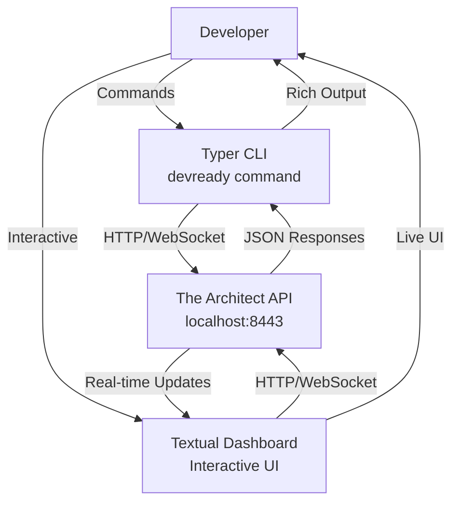
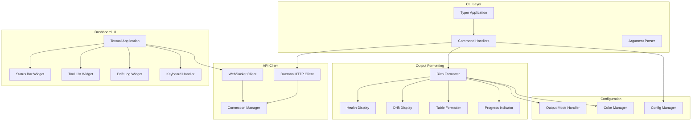
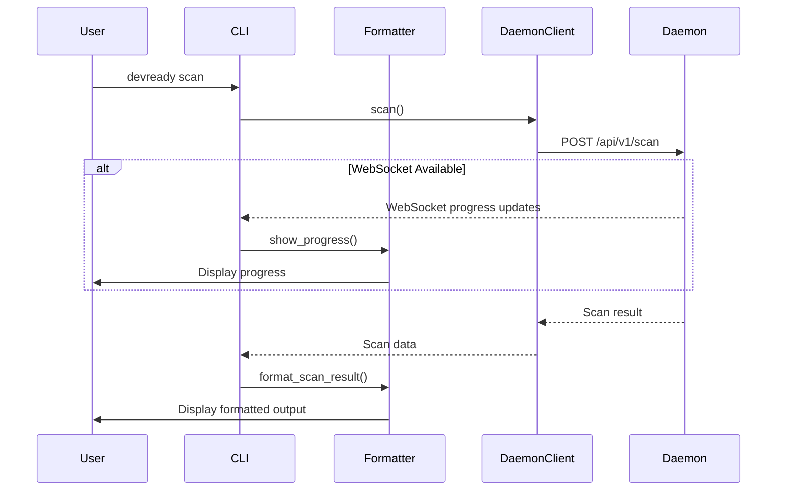
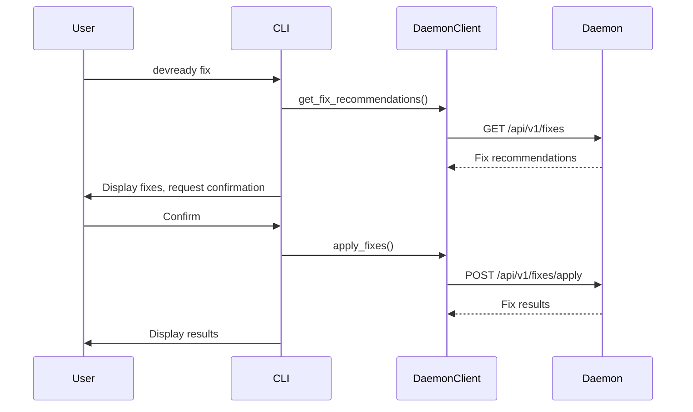

# Design Document: CLI & UI Surfaces (The Face)

## Overview

The Face is the user-facing interface layer of DevReady, providing delightful developer experiences through a Typer-based CLI, Rich-powered terminal outputs, and a Textual interactive dashboard. It acts as the primary interaction point for developers, translating The Architect's API responses into beautiful, actionable terminal interfaces.

This component operates as a lightweight client that communicates with The Architect's FastAPI daemon on localhost:8443. It supports both interactive terminal sessions and non-interactive CI/CD modes, providing consistent experiences across development workflows. All commands complete within 2 seconds excluding scan time, maintaining the snappy, responsive feel developers expect from modern CLI tools.

The architecture prioritizes:
- **Developer Experience**: Beautiful, intuitive interfaces that feel natural
- **Performance**: Snappy responses with progressive output streaming
- **Flexibility**: Works in interactive terminals and CI/CD pipelines
- **Clarity**: Clear, actionable feedback with helpful error messages

## Architecture

### System Context



### Component Architecture



### Technology Stack

- **CLI Framework**: Typer 0.12+ (type-hint based CLI with auto-help)
- **Terminal Output**: Rich 13.7+ (beautiful terminal formatting)
- **Interactive UI**: Textual 0.52+ (TUI framework)
- **HTTP Client**: httpx 0.27+ (async HTTP client)
- **WebSocket**: websockets 12.0+ (WebSocket client)
- **Configuration**: PyYAML 6.0+ (config file parsing)

### Deployment Model

The Face runs as a command-line application:
- Installed as `devready` command via pip/pipx
- Communicates with local daemon on localhost:8443
- Supports both interactive and non-interactive modes
- Packaged with PyInstaller for standalone distribution

## Components and Interfaces

### 1. Typer CLI Application

**Responsibility**: Main CLI entry point and command routing

**Key Structure**:
```python
import typer
from typing import Optional

app = typer.Typer(
    name="devready",
    help="DevReady - Your Dev Environment Health Co-Pilot",
    add_completion=True,
    rich_markup_mode="rich"
)

# Global options
@app.callback()
def main(
    ctx: typer.Context,
    verbose: bool = typer.Option(False, "--verbose", "-v", help="Enable verbose output"),
    quiet: bool = typer.Option(False, "--quiet", "-q", help="Suppress non-essential output"),
    json_output: bool = typer.Option(False, "--json", help="Output results as JSON"),
    no_color: bool = typer.Option(False, "--no-color", help="Disable colored output"),
):
    """DevReady CLI - Environment health monitoring and fixing."""
    ctx.obj = CLIContext(
        verbose=verbose,
        quiet=quiet,
        json_output=json_output,
        no_color=no_color
    )

@app.command()
def scan(
    scope: Optional[str] = typer.Option(None, "--scope", help="Scan scope: full, system, dependencies, configs"),
    project_path: Optional[str] = typer.Option(None, "--project", help="Project path to scan"),
):
    """Scan your development environment for issues."""
    # Implementation

@app.command()
def fix(
    dry_run: bool = typer.Option(False, "--dry-run", help="Preview fixes without applying"),
    auto_approve: bool = typer.Option(False, "--yes", "-y", help="Auto-approve all fixes"),
):
    """Apply recommended fixes for detected issues."""
    # Implementation

@app.command()
def status():
    """Show current environment health status."""
    # Implementation

@app.command()
def drift(
    baseline: Optional[str] = typer.Option(None, "--baseline", help="Baseline snapshot ID"),
    policy: bool = typer.Option(False, "--policy", help="Compare against team policy"),
):
    """Show environment drift since last scan."""
    # Implementation

@app.command()
def dashboard():
    """Launch interactive terminal dashboard."""
    # Implementation
```

**Command Categories**:
- Core: scan, fix, status, drift
- Snapshots: snapshot create/list/delete/export/import
- Team: team status/sync
- History: history
- Diagnostics: doctor
- Daemon: daemon start/stop/restart/status/logs

### 2. Daemon Client

**Responsibility**: HTTP communication with The Architect API

**Key Methods**:
```python
class DaemonClient:
    def __init__(self, base_url: str = "http://localhost:8443"):
        self.base_url = base_url
        self.client = httpx.AsyncClient(timeout=30.0)
        self.connection_manager = ConnectionManager()
    
    async def scan(self, project_path: Optional[str] = None, scope: str = "full") -> Dict:
        """Request a scan from the daemon."""
        try:
            response = await self.client.post(
                f"{self.base_url}/api/v1/scan",
                json={"project_path": project_path, "scope": scope}
            )
            response.raise_for_status()
            return response.json()
        except httpx.ConnectError:
            raise DaemonNotRunningError(
                "Cannot connect to DevReady daemon. "
                "Start it with: devready daemon start"
            )
        except httpx.TimeoutException:
            raise DaemonTimeoutError("Daemon request timed out")
    
    async def get_snapshot(self, snapshot_id: str) -> Dict:
        """Retrieve a snapshot by ID."""
        response = await self.client.get(
            f"{self.base_url}/api/v1/snapshots/{snapshot_id}"
        )
        response.raise_for_status()
        return response.json()
    
    async def get_latest_snapshot(self, project_path: str) -> Optional[Dict]:
        """Get the most recent snapshot for a project."""
        response = await self.client.get(
            f"{self.base_url}/api/v1/snapshots/latest",
            params={"project_path": project_path}
        )
        if response.status_code == 404:
            return None
        response.raise_for_status()
        return response.json()
    
    async def compare_drift(self, snapshot_a_id: str, snapshot_b_id: str) -> Dict:
        """Compare two snapshots for drift."""
        response = await self.client.post(
            f"{self.base_url}/api/v1/drift/compare",
            json={"snapshot_a_id": snapshot_a_id, "snapshot_b_id": snapshot_b_id}
        )
        response.raise_for_status()
        return response.json()
    
    async def check_daemon_health(self) -> bool:
        """Check if daemon is running and responsive."""
        try:
            response = await self.client.get(f"{self.base_url}/api/version", timeout=5.0)
            return response.status_code == 200
        except:
            return False
```

### 3. Rich Formatter

**Responsibility**: Format output using Rich library

**Key Components**:
```python
from rich.console import Console
from rich.table import Table
from rich.panel import Panel
from rich.progress import Progress, SpinnerColumn, TextColumn
from rich.syntax import Syntax

class RichFormatter:
    def __init__(self, no_color: bool = False):
        self.console = Console(no_color=no_color)
    
    def print_health_score(self, score: int):
        """Display health score with color coding."""
        if score >= 90:
            color = "green"
            emoji = "✅"
        elif score >= 70:
            color = "yellow"
            emoji = "⚠️"
        else:
            color = "red"
            emoji = "❌"
        
        self.console.print(
            Panel(
                f"[{color}]{emoji} Health Score: {score}/100[/{color}]",
                title="Environment Health",
                border_style=color
            )
        )
    
    def print_tool_table(self, tools: List[Dict]):
        """Display tools in a formatted table."""
        table = Table(title="Detected Tools", show_header=True)
        table.add_column("Tool", style="cyan")
        table.add_column("Version", style="magenta")
        table.add_column("Path", style="dim")
        table.add_column("Manager", style="green")
        
        for tool in sorted(tools, key=lambda t: t["name"]):
            table.add_row(
                tool["name"],
                tool["version"],
                tool["path"],
                tool.get("manager", "-")
            )
        
        self.console.print(table)
    
    def print_drift_report(self, drift: Dict):
        """Display drift report with diff-style formatting."""
        self.console.print("\n[bold]Environment Drift Report[/bold]\n")
        
        # Added tools
        if drift.get("added_tools"):
            self.console.print("[green]Added Tools:[/green]")
            for tool in drift["added_tools"]:
                self.console.print(f"  [green]+ {tool['name']} {tool['version']}[/green]")
        
        # Removed tools
        if drift.get("removed_tools"):
            self.console.print("\n[red]Removed Tools:[/red]")
            for tool in drift["removed_tools"]:
                self.console.print(f"  [red]- {tool['name']} {tool['version']}[/red]")
        
        # Version changes
        if drift.get("version_changes"):
            self.console.print("\n[yellow]Version Changes:[/yellow]")
            for change in drift["version_changes"]:
                self.console.print(
                    f"  [yellow]{change['tool_name']}: "
                    f"{change['old_version']} → {change['new_version']}[/yellow]"
                )
        
        # Summary
        drift_score = drift.get("drift_score", 0)
        self.console.print(f"\n[bold]Drift Score: {drift_score}/100[/bold]")
    
    def show_progress(self, description: str) -> Progress:
        """Create a progress indicator."""
        return Progress(
            SpinnerColumn(),
            TextColumn("[progress.description]{task.description}"),
            console=self.console
        )
```

### 4. Textual Dashboard

**Responsibility**: Interactive terminal UI for real-time monitoring

**Key Structure**:
```python
from textual.app import App, ComposeResult
from textual.widgets import Header, Footer, Static, DataTable
from textual.containers import Container, Vertical
from textual.reactive import reactive

class DevReadyDashboard(App):
    """Interactive DevReady dashboard."""
    
    CSS = """
    #health-score {
        height: 3;
        border: solid green;
        content-align: center middle;
    }
    
    #tools-table {
        height: 1fr;
    }
    
    #drift-log {
        height: 10;
        border: solid yellow;
    }
    """
    
    BINDINGS = [
        ("q", "quit", "Quit"),
        ("r", "refresh", "Refresh"),
        ("f", "fix", "Apply Fixes"),
        ("s", "scan", "Run Scan"),
    ]
    
    health_score = reactive(0)
    
    def compose(self) -> ComposeResult:
        """Create child widgets."""
        yield Header()
        yield Container(
            Static(id="health-score"),
            DataTable(id="tools-table"),
            Static(id="drift-log"),
        )
        yield Footer()
    
    def on_mount(self) -> None:
        """Initialize dashboard on mount."""
        self.update_health_score()
        self.update_tools_table()
        self.start_websocket_listener()
        
        # Poll for updates every 30 seconds
        self.set_interval(30, self.refresh_data)
    
    async def update_health_score(self):
        """Update health score display."""
        snapshot = await self.daemon_client.get_latest_snapshot(os.getcwd())
        if snapshot:
            self.health_score = snapshot["health_score"]
            
            # Update display with color
            score_widget = self.query_one("#health-score", Static)
            if self.health_score >= 90:
                color = "green"
                emoji = "✅"
            elif self.health_score >= 70:
                color = "yellow"
                emoji = "⚠️"
            else:
                color = "red"
                emoji = "❌"
            
            score_widget.update(f"{emoji} Health Score: {self.health_score}/100")
            score_widget.styles.border = ("solid", color)
    
    async def update_tools_table(self):
        """Update tools table."""
        snapshot = await self.daemon_client.get_latest_snapshot(os.getcwd())
        if snapshot:
            table = self.query_one("#tools-table", DataTable)
            table.clear()
            table.add_columns("Tool", "Version", "Path", "Manager")
            
            for tool in snapshot["tools"]:
                table.add_row(
                    tool["name"],
                    tool["version"],
                    tool["path"],
                    tool.get("manager", "-")
                )
    
    async def start_websocket_listener(self):
        """Listen for real-time updates via WebSocket."""
        async with websockets.connect(f"ws://localhost:8443/ws/scan") as ws:
            async for message in ws:
                data = json.loads(message)
                if data["type"] == "progress":
                    self.update_progress(data)
                elif data["type"] == "complete":
                    await self.refresh_data()
    
    def action_refresh(self):
        """Refresh all data."""
        asyncio.create_task(self.refresh_data())
    
    def action_fix(self):
        """Trigger fix workflow."""
        # Launch fix command in background
        pass
    
    def action_scan(self):
        """Trigger scan."""
        asyncio.create_task(self.daemon_client.scan())
```

### 5. JSON Output Mode

**Responsibility**: Machine-readable output for CI/CD

**Key Methods**:
```python
class JSONOutputHandler:
    def output(self, data: Dict, exit_code: int = 0):
        """Output data as JSON to stdout."""
        output = {
            "command": sys.argv[1] if len(sys.argv) > 1 else "unknown",
            "timestamp": datetime.utcnow().isoformat(),
            "exit_code": exit_code,
            "data": data
        }
        
        # Write to stdout
        print(json.dumps(output, indent=2))
        
        # Exit with appropriate code
        sys.exit(exit_code)
    
    def error(self, message: str, details: Optional[Dict] = None):
        """Output error as JSON."""
        self.output(
            {
                "error": message,
                "details": details or {}
            },
            exit_code=1
        )
```

### 6. Configuration Manager

**Responsibility**: Load and manage CLI configuration

**Key Methods**:
```python
class ConfigManager:
    DEFAULT_CONFIG = {
        "daemon_url": "http://localhost:8443",
        "output_format": "text",  # text, json
        "color": "auto",  # auto, always, never
        "default_scan_scope": "full",
    }
    
    def __init__(self):
        self.config_path = Path.home() / ".devready" / "cli-config.yaml"
        self.config = self.load_config()
    
    def load_config(self) -> Dict:
        """Load configuration from file."""
        if not self.config_path.exists():
            return self.DEFAULT_CONFIG.copy()
        
        try:
            with open(self.config_path) as f:
                user_config = yaml.safe_load(f)
            
            # Merge with defaults
            config = self.DEFAULT_CONFIG.copy()
            config.update(user_config)
            return config
        except Exception as e:
            logger.warning(f"Failed to load config: {e}, using defaults")
            return self.DEFAULT_CONFIG.copy()
    
    def get(self, key: str, default: Any = None) -> Any:
        """Get configuration value."""
        return self.config.get(key, default)
    
    def set(self, key: str, value: Any):
        """Set configuration value."""
        self.config[key] = value
        self.save_config()
    
    def save_config(self):
        """Save configuration to file."""
        self.config_path.parent.mkdir(parents=True, exist_ok=True)
        with open(self.config_path, "w") as f:
            yaml.dump(self.config, f)
```

### 7. Error Handling

**Responsibility**: User-friendly error messages

**Error Types**:
```python
class CLIError(Exception):
    """Base exception for CLI errors."""
    pass

class DaemonNotRunningError(CLIError):
    """Daemon is not running."""
    def __init__(self):
        super().__init__(
            "Cannot connect to DevReady daemon.\n"
            "Start it with: [bold]devready daemon start[/bold]"
        )

class DaemonTimeoutError(CLIError):
    """Daemon request timed out."""
    pass

class InvalidCommandError(CLIError):
    """Invalid command or arguments."""
    pass
```

**Error Display**:
```python
def handle_error(error: Exception, json_mode: bool = False):
    """Display error to user."""
    if json_mode:
        json_handler.error(str(error), {"type": type(error).__name__})
    else:
        console = Console()
        console.print(f"[red]✗ Error:[/red] {error}")
        
        # Provide helpful suggestions
        if isinstance(error, DaemonNotRunningError):
            console.print("\n[yellow]Tip:[/yellow] Start the daemon with:")
            console.print("  [bold]devready daemon start[/bold]")
```

### 8. Progress Indicators

**Responsibility**: Show progress during long operations

**Implementations**:
```python
class ProgressIndicator:
    def __init__(self, console: Console):
        self.console = console
    
    def spinner(self, description: str):
        """Show spinner for indeterminate progress."""
        return self.console.status(description, spinner="dots")
    
    def progress_bar(self, total: int, description: str):
        """Show progress bar for determinate progress."""
        return Progress(
            TextColumn("[progress.description]{task.description}"),
            BarColumn(),
            TextColumn("[progress.percentage]{task.percentage:>3.0f}%"),
            console=self.console
        )
    
    def websocket_progress(self, ws_url: str):
        """Show progress from WebSocket updates."""
        async def listen():
            async with websockets.connect(ws_url) as ws:
                async for message in ws:
                    data = json.loads(message)
                    if data["type"] == "progress":
                        self.console.print(
                            f"[dim]{data['stage']}:[/dim] {data['message']}"
                        )
        
        return listen()
```

## Data Flow

### Scan Command Flow



### Fix Command Flow



## Performance Requirements

- Command initialization: < 200ms
- First output: < 500ms
- API request timeout: 30 seconds
- Dashboard refresh: < 1 second
- WebSocket reconnection: < 2 seconds
- Cache daemon connection: Reuse for session

## Testing Strategy

- Unit tests for formatters and handlers
- Integration tests for daemon communication
- UI tests for Textual dashboard
- Property tests for output consistency
- Performance tests for responsiveness
- Cross-platform tests for terminal compatibility

## Security Considerations

- Never display sensitive data (tokens, passwords)
- Sanitize all user inputs
- Validate daemon responses
- Use HTTPS for future cloud features
- Respect user privacy in telemetry
