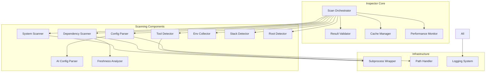
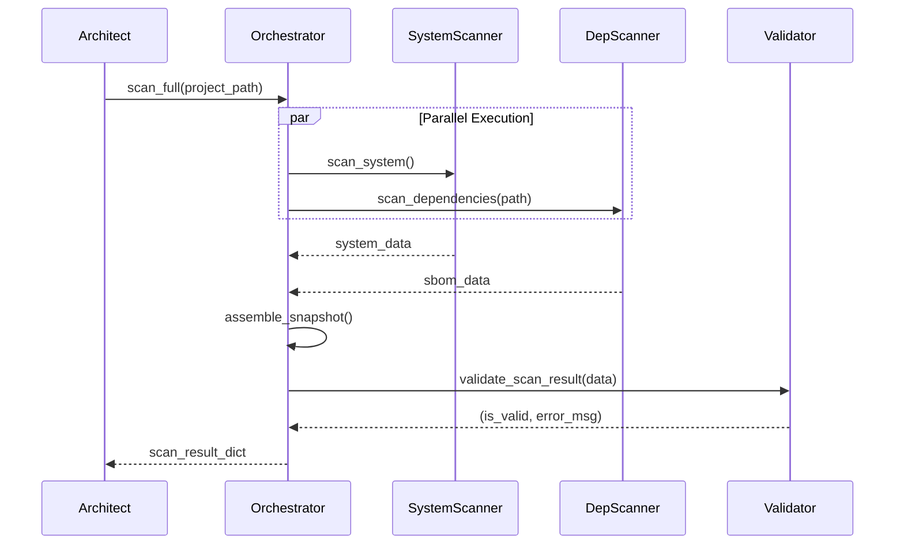

# Design Document: Inspector (Scanning & Intelligence)

## Overview

The Inspector is the scanning and intelligence component of DevReady CLI, responsible for collecting comprehensive system state, dependency information, and configuration data. It operates as a pure data collection layer that feeds The Architect's API with accurate, structured environment information through Python wrappers around industry-standard tools.

The Inspector is designed for speed (< 8 second full scans), reliability (100% offline operation), and accuracy (returns dictionaries matching The Architect's Pydantic schemas). It orchestrates multiple scanning components in parallel, handles errors gracefully, and provides partial results when individual scanners fail.

Key design principles:
- **Performance**: Parallel execution, caching, subprocess timeouts
- **Reliability**: Graceful degradation, comprehensive error handling, partial results
- **Accuracy**: Schema validation, type safety, structured output
- **Maintainability**: Clear separation of concerns, testable components, extensive logging

The Inspector integrates with:
- **osquery-python**: System-level state queries (installed tools, processes, ports)
- **syft**: SBOM generation for project dependencies
- **Custom parsers**: AI agent configuration files (CLAUDE.md, .cursorrules)
- **Checkov**: Policy validation and compliance checking

## Architecture

### System Context

```mermaid
graph TB
    Architect[The Architect API<br/>FastAPI Daemon]
    
    Inspector[Inspector Module<br/>Scan Orchestrator]
    
    SystemScanner[System Scanner<br/>osquery-python]
    DepScanner[Dependency Scanner<br/>syft subprocess]
    ConfigParser[Config Parser<br/>Custom parsers]
    PolicyChecker[Policy Checker<br/>Checkov integration]
    
    OSQuery[osquery<br/>System queries]
    Syft[syft CLI<br/>SBOM generation]
    
    Architect -->|Calls scan()| Inspector
    Inspector -->|Orchestrates| SystemScanner
    Inspector -->|Orchestrates| DepScanner
    Inspector -->|Orchestrates| ConfigParser
    Inspector -->|Validates with| PolicyChecker
    
    SystemScanner -->|Queries via Python| OSQuery
    DepScanner -->|Executes subprocess| Syft
    
    Inspector -->|Returns dict| Architect
    
    style Inspector fill:#e1f5ff
    style Architect fill:#fff4e1
```

### Component Architecture



### Technology Stack

- **Core Language**: Python 3.11+
- **System Queries**: osquery-python 3.0+ (Python bindings for osquery)
- **SBOM Generation**: syft CLI (executed as subprocess)
- **Policy Validation**: Checkov 3.0+ (Python library)
- **Data Validation**: Pydantic 2.6+ (schema validation, type safety)
- **Async Execution**: asyncio (parallel scanner execution)
- **Path Handling**: pathlib (cross-platform path operations)
- **Subprocess Management**: subprocess module with timeout support
- **Caching**: In-memory LRU cache with TTL
- **Logging**: Python logging module

### Execution Model

The Inspector operates in two modes:

**1. Full Scan Mode** (default):
- Executes all scanners in parallel using asyncio
- Assembles complete EnvironmentSnapshot
- Target: < 8 seconds total duration

**2. Incremental Scan Mode**:
- Executes only requested scanners
- Returns partial results
- Target: < 3 seconds for targeted scans

**Parallel Execution Strategy**:
```python
async def scan_full(project_path: Optional[str] = None) -> Dict[str, Any]:
    # Execute independent scanners in parallel
    results = await asyncio.gather(
        scan_system(),           # 2 seconds
        scan_dependencies(path), # 4 seconds
        scan_configs(path),      # 1 second
        scan_tools(),            # 3 seconds
        scan_env_vars(),         # 0.5 seconds
        return_exceptions=True   # Don't fail entire scan if one fails
    )
    # Assemble and validate results
    return assemble_snapshot(results)
```

## Components and Interfaces

### 1. Scan Orchestrator

**Responsibility**: Coordinate all scanning components, assemble results, handle errors

**Public Interface**:
```python
async def scan_full(
    project_path: Optional[str] = None,
    force_refresh: bool = False
) -> Dict[str, Any]:
    """
    Execute full environment scan.
    
    Args:
        project_path: Override automatic project detection
        force_refresh: Bypass caches
        
    Returns:
        Dictionary matching EnvironmentSnapshot schema
        
    Raises:
        ScanError: If all scanners fail
    """


async def scan_incremental(
    scope: Literal["system_only", "dependencies_only", "configs_only"],
    project_path: Optional[str] = None
) -> Dict[str, Any]:
    """
    Execute targeted scan of specific components.
    
    Args:
        scope: Which scanners to execute
        project_path: Override automatic project detection
        
    Returns:
        Partial dictionary with only requested data
    """
```

**Implementation Details**:
- Uses asyncio.gather() for parallel execution
- Collects timing data for each scanner
- Handles individual scanner failures gracefully
- Validates final result against EnvironmentSnapshot schema
- Includes error list in result if any scanner fails

**Error Handling**:
- If all scanners fail: Raise ScanError with details
- If some scanners fail: Return partial results with errors list
- If validation fails: Log error and return raw data with validation_failed flag

### 2. System Scanner (osquery-python wrapper)

**Responsibility**: Query OS-level state using osquery

**Public Interface**:
```python
async def scan_system() -> Dict[str, Any]:
    """
    Query system state using osquery.
    
    Returns:
        {
            "os_version": str,
            "architecture": str,
            "listening_ports": List[Dict],
            "installed_packages": List[Dict]
        }
    """
```


**osquery Queries**:
```python
# OS version and architecture
SELECT version, arch FROM os_version;

# Listening network ports
SELECT port, process_name, pid FROM listening_ports;

# Installed packages (varies by OS)
# macOS: SELECT name, version, source FROM homebrew_packages;
# Linux: SELECT name, version, source FROM deb_packages;
# Windows: SELECT name, version FROM programs;
```

**Package Manager Detection**:
- macOS: brew (Homebrew)
- Linux: apt, yum, dnf, pacman
- Windows: chocolatey, winget, scoop

**Performance Target**: < 2 seconds

**Error Handling**:
- If osquery not available: Log error, return empty result
- If query fails: Log error with query details, continue with other queries
- If query times out (> 5 seconds): Kill query, log timeout

### 3. Dependency Scanner (syft wrapper)

**Responsibility**: Generate SBOM using syft subprocess

**Public Interface**:
```python
async def scan_dependencies(project_path: str) -> Dict[str, Any]:
    """
    Generate SBOM for project using syft.
    
    Args:
        project_path: Root directory to scan
        
    Returns:
        {
            "artifacts": List[Dict],  # Parsed from syft JSON
            "sbom_format": str,
            "scan_duration": float
        }
    """
```


**syft Execution**:
```python
# Command: syft scan dir:{project_path} -o json
result = await subprocess_wrapper.execute(
    ["syft", "scan", f"dir:{project_path}", "-o", "json"],
    timeout=10.0
)
```

**SBOM Parsing**:
- Parse syft's JSON output
- Extract: package name, version, type (npm, pip, cargo, etc.), location
- Support ecosystems: npm, pip, cargo, go modules, maven, gradle

**Performance Target**: < 4 seconds for typical projects

**Error Handling**:
- If syft not installed: Return error with installation instructions
- If syft fails: Capture stderr, return in error details
- If output malformed: Log parsing error, return raw output

**Caching Strategy**:
- Cache SBOM results for 1 minute per project
- Invalidate cache if project files modified (check mtime)
- Cache key: (project_path, max_mtime_of_manifests)

### 4. Config Parser

**Responsibility**: Parse AI agent configuration files

**Public Interface**:
```python
async def scan_configs(project_path: str) -> List[Dict[str, Any]]:
    """
    Find and parse AI agent config files.
    
    Args:
        project_path: Root directory to search
        
    Returns:
        List of config dictionaries, one per file found
    """
```


**Supported Config Files**:
- `CLAUDE.md`: Markdown format, extract sections
- `.cursorrules`: JSON or YAML format
- `.copilot`: JSON format
- `AGENTS.md`: Markdown format
- `.aider.conf.yml`: YAML format

**Parsing Strategy**:
```python
def parse_claude_md(content: str) -> Dict:
    # Extract markdown sections as structured data
    # Identify: custom instructions, system prompts, tool configs
    # Extract: referenced file paths, API endpoints, dependencies
    pass

def parse_cursorrules(content: str) -> Dict:
    # Try JSON first, fall back to YAML
    # Normalize to common schema
    # Extract: model preferences, parameters (temperature, max_tokens)
    pass
```

**Merge Strategy**:
- If multiple configs exist, parse all
- .cursorrules takes precedence over CLAUDE.md for overlapping settings
- Return list of all configs with precedence order

**Error Handling**:
- If no configs found: Return empty list
- If parsing fails: Log error, include raw content in result
- If file unreadable: Log error, skip file

### 5. Tool Detector

**Responsibility**: Detect installed development tools and their versions

**Public Interface**:
```python
async def detect_tools() -> List[Dict[str, Any]]:
    """
    Detect common development tools and their versions.
    
    Returns:
        List of ToolVersion dictionaries
    """
```


**Tool Detection Strategy**:
```python
TOOLS_TO_DETECT = [
    ("node", ["node", "--version"]),
    ("python", ["python", "--version"]),
    ("go", ["go", "version"]),
    ("rustc", ["rustc", "--version"]),
    ("java", ["java", "-version"]),
    ("docker", ["docker", "--version"]),
    ("git", ["git", "--version"]),
]

async def detect_tool(name: str, cmd: List[str]) -> Optional[ToolVersion]:
    result = await subprocess_wrapper.execute(cmd, timeout=1.0)
    if result.exit_code == 0:
        version = parse_version_from_output(result.stdout)
        path = shutil.which(name)
        manager = detect_version_manager(name, path)
        return ToolVersion(name=name, version=version, path=path, manager=manager)
    return None
```

**Version Manager Detection**:
- nvm: Check if path contains `.nvm/`
- pyenv: Check if path contains `.pyenv/`
- asdf: Check if path contains `.asdf/`
- mise: Check if path contains `.mise/` or `.local/share/mise/`
- rustup: Check if path contains `.rustup/`
- sdkman: Check if path contains `.sdkman/`

**Performance Target**: < 3 seconds (parallel execution with 1-second timeout per tool)

**Caching Strategy**:
- Cache tool versions for 5 minutes
- Cache key: tool_name
- Invalidate on force_refresh

### 6. Environment Variable Collector

**Responsibility**: Collect and filter relevant environment variables

**Public Interface**:
```python
def collect_env_vars() -> Dict[str, str]:
    """
    Collect development-relevant environment variables.
    
    Returns:
        Dictionary of variable names to values (sensitive values redacted)
    """
```


**Filtering Strategy**:
```python
RELEVANT_VARS = [
    "PATH", "NODE_ENV", "PYTHON_PATH", "PYTHONPATH",
    "GOPATH", "GOROOT", "CARGO_HOME", "RUSTUP_HOME",
    "JAVA_HOME", "MAVEN_HOME", "GRADLE_HOME"
]

SENSITIVE_PATTERNS = [
    "token", "key", "secret", "password", "api",
    "auth", "credential", "private"
]

def is_sensitive(var_name: str) -> bool:
    return any(pattern in var_name.lower() for pattern in SENSITIVE_PATTERNS)

def collect_env_vars() -> Dict[str, str]:
    result = {}
    for var in RELEVANT_VARS:
        if var in os.environ:
            result[var] = os.environ[var]
    
    # Also check for sensitive vars to redact
    for var, value in os.environ.items():
        if var in result:
            continue
        if is_sensitive(var):
            result[var] = "[REDACTED]"
    
    return result
```

**.env File Parsing**:
```python
def parse_dotenv(project_path: str) -> Dict[str, str]:
    dotenv_path = Path(project_path) / ".env"
    if not dotenv_path.exists():
        return {}
    
    result = {}
    for line in dotenv_path.read_text().splitlines():
        line = line.strip()
        if not line or line.startswith("#"):
            continue
        if "=" not in line:
            logger.warning(f"Malformed .env line: {line}")
            continue
        key, value = line.split("=", 1)
        if is_sensitive(key):
            result[key] = "[REDACTED]"
        else:
            result[key] = value
    
    return result
```

**Security**: Never log or return actual sensitive values

### 7. Project Root Detector

**Responsibility**: Automatically detect project root directory

**Public Interface**:
```python
def detect_project_root(start_path: Optional[str] = None) -> Tuple[str, str]:
    """
    Detect project root and extract project name.
    
    Args:
        start_path: Starting directory (defaults to cwd)
        
    Returns:
        (project_root_path, project_name)
    """
```


**Detection Strategy**:
```python
PROJECT_MARKERS = [
    ".git",           # Priority 1: Git repository
    "package.json",   # Node.js
    "pyproject.toml", # Python
    "Cargo.toml",     # Rust
    "go.mod",         # Go
    "pom.xml",        # Java (Maven)
    "build.gradle",   # Java (Gradle)
]

def detect_project_root(start_path: Optional[str] = None) -> Tuple[str, str]:
    current = Path(start_path or os.getcwd()).resolve()
    
    # Traverse up to 10 parent directories
    for _ in range(10):
        for marker in PROJECT_MARKERS:
            if (current / marker).exists():
                project_name = extract_project_name(current, marker)
                return str(current), project_name
        
        if current.parent == current:  # Reached filesystem root
            break
        current = current.parent
    
    # Fallback: use start_path
    return str(Path(start_path or os.getcwd()).resolve()), Path.cwd().name

def extract_project_name(root: Path, marker: str) -> str:
    # Try to extract from manifest
    if marker == "package.json":
        data = json.loads((root / marker).read_text())
        return data.get("name", root.name)
    elif marker == "pyproject.toml":
        data = toml.loads((root / marker).read_text())
        return data.get("project", {}).get("name", root.name)
    elif marker == "Cargo.toml":
        data = toml.loads((root / marker).read_text())
        return data.get("package", {}).get("name", root.name)
    
    # Fallback: directory name
    return root.name
```

**Performance Target**: < 100ms

### 8. Tech Stack Detector

**Responsibility**: Identify programming language ecosystem

**Public Interface**:
```python
def detect_tech_stack(project_path: str) -> List[str]:
    """
    Identify tech stacks present in project.
    
    Args:
        project_path: Project root directory
        
    Returns:
        List of detected stacks (e.g., ["nodejs", "python"])
    """
```


**Detection Rules**:
```python
STACK_MARKERS = {
    "nodejs": ["package.json", "node_modules"],
    "python": ["pyproject.toml", "setup.py", "requirements.txt", "Pipfile"],
    "go": ["go.mod", "go.sum"],
    "rust": ["Cargo.toml", "Cargo.lock"],
    "java": ["pom.xml", "build.gradle", "build.gradle.kts"],
}

def detect_tech_stack(project_path: str) -> List[str]:
    root = Path(project_path)
    detected = []
    
    for stack, markers in STACK_MARKERS.items():
        if any((root / marker).exists() for marker in markers):
            detected.append(stack)
    
    return detected if detected else ["unknown"]
```

**Monorepo Support**: Returns multiple stacks if multiple markers found

### 9. Policy Checker (Checkov integration)

**Responsibility**: Validate scan results against team policies

**Public Interface**:
```python
def check_policy(
    scan_result: Dict[str, Any],
    team_policy: Dict[str, Any]
) -> List[Dict[str, Any]]:
    """
    Validate scan results against team policy.
    
    Args:
        scan_result: Output from scan_full()
        team_policy: Team policy definition
        
    Returns:
        List of policy violations
    """
```


**Validation Checks**:
```python
def check_policy(scan_result: Dict, team_policy: Dict) -> List[Dict]:
    violations = []
    
    # Check required tools
    for required in team_policy.get("required_tools", []):
        if not tool_present(scan_result["tools"], required["name"]):
            violations.append({
                "rule_id": "MISSING_REQUIRED_TOOL",
                "severity": "error",
                "message": f"Required tool {required['name']} not found",
                "affected_component": required["name"]
            })
    
    # Check version constraints
    for tool in scan_result["tools"]:
        constraint = team_policy.get("version_constraints", {}).get(tool["name"])
        if constraint and not version_satisfies(tool["version"], constraint):
            violations.append({
                "rule_id": "VERSION_MISMATCH",
                "severity": "warning",
                "message": f"{tool['name']} version {tool['version']} does not satisfy {constraint}",
                "affected_component": tool["name"]
            })
    
    # Check forbidden tools
    for tool in scan_result["tools"]:
        if tool["name"] in team_policy.get("forbidden_tools", []):
            violations.append({
                "rule_id": "FORBIDDEN_TOOL",
                "severity": "error",
                "message": f"Forbidden tool {tool['name']} detected",
                "affected_component": tool["name"]
            })
    
    # Check for CVEs in dependencies (using Checkov or vulnerability DB)
    # ... CVE checking logic ...
    
    return violations
```

### 10. Subprocess Wrapper

**Responsibility**: Safe subprocess execution with timeout and error handling

**Public Interface**:
```python
@dataclass
class SubprocessResult:
    exit_code: int
    stdout: str
    stderr: str
    duration_seconds: float
    timed_out: bool

async def execute(
    cmd: List[str],
    timeout: float = 5.0,
    cwd: Optional[str] = None
) -> SubprocessResult:
    """
    Execute command with timeout and capture output.
    
    Args:
        cmd: Command and arguments
        timeout: Timeout in seconds
        cwd: Working directory
        
    Returns:
        SubprocessResult with exit code and output
    """
```


**Implementation**:
```python
async def execute(cmd: List[str], timeout: float = 5.0, cwd: Optional[str] = None) -> SubprocessResult:
    # Sanitize command arguments
    sanitized_cmd = [str(arg) for arg in cmd]
    
    # Log command execution
    logger.debug(f"Executing: {' '.join(sanitized_cmd)}")
    
    start_time = time.time()
    timed_out = False
    
    try:
        process = await asyncio.create_subprocess_exec(
            *sanitized_cmd,
            stdout=asyncio.subprocess.PIPE,
            stderr=asyncio.subprocess.PIPE,
            cwd=cwd
        )
        
        stdout, stderr = await asyncio.wait_for(
            process.communicate(),
            timeout=timeout
        )
        
        exit_code = process.returncode
        
    except asyncio.TimeoutError:
        process.kill()
        await process.wait()
        stdout, stderr = b"", b"Command timed out"
        exit_code = -1
        timed_out = True
    
    duration = time.time() - start_time
    
    return SubprocessResult(
        exit_code=exit_code,
        stdout=stdout.decode("utf-8", errors="replace"),
        stderr=stderr.decode("utf-8", errors="replace"),
        duration_seconds=duration,
        timed_out=timed_out
    )
```

**Security**: Sanitizes arguments to prevent shell injection

### 11. Result Validator

**Responsibility**: Validate scan results against The Architect's schemas

**Public Interface**:
```python
def validate_scan_result(data: Dict[str, Any]) -> Tuple[bool, Optional[str]]:
    """
    Validate scan result against EnvironmentSnapshot schema.
    
    Args:
        data: Scan result dictionary
        
    Returns:
        (is_valid, error_message)
    """
```


**Implementation**:
```python
from pydantic import ValidationError

def validate_scan_result(data: Dict[str, Any]) -> Tuple[bool, Optional[str]]:
    try:
        # Import EnvironmentSnapshot from The Architect
        from architect.models import EnvironmentSnapshot
        
        # Attempt validation
        EnvironmentSnapshot(**data)
        return True, None
        
    except ValidationError as e:
        error_msg = f"Validation failed: {e.error_count()} errors\n"
        for error in e.errors():
            field = ".".join(str(loc) for loc in error["loc"])
            error_msg += f"  - {field}: {error['msg']}\n"
        return False, error_msg
    
    except Exception as e:
        return False, f"Unexpected validation error: {str(e)}"
```

### 12. Cache Manager

**Responsibility**: Cache expensive operations for performance

**Public Interface**:
```python
class CacheManager:
    def get(self, key: str) -> Optional[Any]:
        """Get cached value if not expired."""
        
    def set(self, key: str, value: Any, ttl_seconds: int):
        """Cache value with TTL."""
        
    def invalidate(self, key: str):
        """Remove cached value."""
        
    def clear(self):
        """Clear all caches."""
```

**Cache Configuration**:
- Tool versions: 5 minutes TTL
- SBOM results: 1 minute TTL
- Project root detection: No expiration (path-based)

**Implementation**: In-memory dictionary with expiration timestamps

### 13. Performance Monitor

**Responsibility**: Track scanner execution times and resource usage

**Public Interface**:
```python
class PerformanceMonitor:
    def start_timer(self, component: str):
        """Start timing a component."""
        
    def stop_timer(self, component: str) -> float:
        """Stop timer and return duration."""
        
    def get_metrics(self) -> Dict[str, Any]:
        """Get all timing metrics."""
```


**Metrics Collected**:
- Per-component execution time
- Total scan duration
- Cache hit/miss rates
- Number of subprocess executions
- Memory usage (optional)

**Performance Warnings**:
- Log warning if any component exceeds its time budget
- Log warning if total scan exceeds 8 seconds

### 14. Path Handler

**Responsibility**: Cross-platform path operations

**Public Interface**:
```python
class PathHandler:
    @staticmethod
    def normalize(path: str) -> str:
        """Normalize path to use forward slashes."""
        
    @staticmethod
    def expand_home(path: str) -> str:
        """Expand ~ to home directory."""
        
    @staticmethod
    def resolve_symlinks(path: str) -> str:
        """Resolve symlinks to actual targets."""
        
    @staticmethod
    def validate_exists(path: str) -> bool:
        """Check if path exists."""
```

**Implementation**: Uses pathlib for all operations

### 15. Freshness Analyzer

**Responsibility**: Analyze dependency freshness and identify outdated packages

**Public Interface**:
```python
def analyze_freshness(
    dependencies: Dict[str, List[str]],
    use_cache: bool = True
) -> Dict[str, Any]:
    """
    Analyze dependency freshness.
    
    Args:
        dependencies: Dict of ecosystem -> list of "name@version"
        use_cache: Use cached version data
        
    Returns:
        {
            "freshness_score": int,  # 0-100
            "outdated": List[Dict],
            "deprecated": List[Dict],
            "vulnerable": List[Dict]
        }
    """
```

**Analysis Strategy**:
- Compare versions against latest stable (from cache or registry)
- Categorize: current, minor_update_available, major_update_available, deprecated
- Check for known CVEs (using vulnerability database)
- Calculate freshness score based on update recency

**Offline Operation**: Uses cached data when offline, marks results as potentially stale

## Data Models

### Core Data Structures

**ToolVersion** (matches The Architect's schema):
```python
@dataclass(frozen=True)
class ToolVersion:
    name: str
    version: str
    path: str
    manager: Optional[str] = None
```


**ScanResult** (matches The Architect's EnvironmentSnapshot):
```python
{
    "timestamp": "2026-04-08T10:30:00Z",  # ISO 8601
    "project_path": "/path/to/project",
    "project_name": "my-project",
    "tech_stack": ["nodejs", "python"],
    "tools": [
        {
            "name": "node",
            "version": "20.11.0",
            "path": "/usr/local/bin/node",
            "manager": "nvm"
        }
    ],
    "dependencies": {
        "npm": ["express@4.18.0", "react@18.2.0"],
        "pip": ["fastapi@0.110.0", "pydantic@2.6.0"]
    },
    "env_vars": {
        "NODE_ENV": "development",
        "PYTHON_PATH": "/usr/local/lib/python3.11",
        "API_KEY": "[REDACTED]"
    },
    "ai_configs": [
        {
            "file_path": "/path/to/project/CLAUDE.md",
            "agent_type": "claude",
            "settings": {...},
            "dependencies": [],
            "last_modified": "2026-04-01T12:00:00Z"
        }
    ],
    "scan_duration_seconds": 6.2,
    "errors": []  # Empty if no errors
}
```

**PolicyViolation**:
```python
{
    "rule_id": "MISSING_REQUIRED_TOOL",
    "severity": "error",  # or "warning"
    "message": "Required tool python not found",
    "affected_component": "python"
}
```

**AIConfig**:
```python
{
    "file_path": str,
    "agent_type": str,  # "claude", "cursor", "copilot", "aider"
    "settings": Dict[str, Any],
    "dependencies": List[str],
    "last_modified": str  # ISO 8601
}
```

### Data Flow



## Correctness Properties

*A property is a characteristic or behavior that should hold true across all valid executions of a system—essentially, a formal statement about what the system should do. Properties serve as the bridge between human-readable specifications and machine-verifiable correctness guarantees.*


### Property Reflection

After analyzing all acceptance criteria, I've identified several areas where properties can be consolidated:

**Redundancy Analysis**:
1. **Tool/Config Structure Properties**: Requirements 1.2, 1.4, 2.4, 3.5, 6.6, 12.3, 15.4 all test that returned data contains required fields. These can be combined into comprehensive structure validation properties.

2. **Stack Detection Properties**: Requirements 5.1-5.5 all follow the same pattern (marker present → stack detected). These can be combined into a single property about marker-based detection.

3. **Error Handling Properties**: Requirements 1.8, 3.8, 8.6, 15.3 all test that errors don't crash the system. These can be combined into a general error resilience property.

4. **Logging Properties**: Requirements 19.1-19.4 all test logging behavior. These can be combined into comprehensive logging properties.

5. **Performance Properties**: Requirements 1.6, 2.6, 4.7, 7.4, 9.6, 10.7, 14.5 all test timing. These can be kept separate as they test different components.

6. **Validation Properties**: Requirements 13.1-13.7 all relate to result validation and can be consolidated.

**Consolidated Property Set**:
After reflection, I've reduced ~80 testable criteria to ~45 unique properties by:
- Combining structure validation properties
- Merging similar detection logic properties
- Consolidating error handling properties
- Grouping related logging properties
- Keeping performance properties separate (different components)

### Property 1: System Scanner Returns Required Fields

*For any* system scan result, all tool entries should contain the required fields: name, version, path, and manager (which may be null).

**Validates: Requirements 1.2**

### Property 2: System Scanner Includes OS Information

*For any* system scan result, the result should include os_version and architecture fields.

**Validates: Requirements 1.5**

### Property 3: System Scanner Port Data Structure

*For any* listening port entry in a system scan result, the entry should contain port number, process name, and PID.

**Validates: Requirements 1.4**


### Property 4: System Scanner Performance

*For any* system scan execution, the scan should complete within 2 seconds.

**Validates: Requirements 1.6**

### Property 5: System Scanner Error Resilience

*For any* osquery error or failure, the System Scanner should return a result (possibly empty) without raising exceptions.

**Validates: Requirements 1.8**

### Property 6: Dependency Scanner Path Inclusion

*For any* project path provided to the Dependency Scanner, the syft subprocess command should include that path as an argument.

**Validates: Requirements 2.2**

### Property 7: SBOM Artifact Structure

*For any* parsed SBOM artifact, the artifact should contain package name, version, type, and location fields.

**Validates: Requirements 2.4**

### Property 8: SBOM Ecosystem Support

*For any* SBOM containing artifacts from supported ecosystems (npm, pip, cargo, go modules, maven, gradle), all artifacts should be correctly parsed with their ecosystem type identified.

**Validates: Requirements 2.5**

### Property 9: Dependency Scanner Performance

*For any* typical project (< 1000 dependencies), SBOM generation should complete within 4 seconds.

**Validates: Requirements 2.6**

### Property 10: Dependency Scanner Error Details

*For any* syft execution failure, the error details should include the captured stderr output.

**Validates: Requirements 2.8**

### Property 11: Config File Discovery

*For any* project directory containing AI agent config files (CLAUDE.md, .cursorrules, .copilot, AGENTS.md, .aider.conf.yml), the Config Parser should find and return all present config files.

**Validates: Requirements 3.1, 3.6**

### Property 12: Config Result Structure

*For any* parsed config file, the result should contain the required fields: file_path, agent_type, settings, dependencies, and last_modified.

**Validates: Requirements 3.5**

### Property 13: Config Parser Error Resilience

*For any* malformed config file, the Config Parser should handle the error gracefully without crashing and log the parsing error.

**Validates: Requirements 3.8**

### Property 14: Project Root Marker Detection

*For any* directory containing project markers (.git, package.json, pyproject.toml, Cargo.toml, go.mod, pom.xml, build.gradle), the Root Detector should identify the directory as a project root.

**Validates: Requirements 4.1, 4.3**

### Property 15: Project Root Returns Absolute Path

*For any* detected project root, the returned path should be an absolute path (not relative).

**Validates: Requirements 4.5**

### Property 16: Project Name Extraction

*For any* detected project root, the Root Detector should return a non-empty project name.

**Validates: Requirements 4.6**

### Property 17: Root Detection Performance

*For any* project root detection operation, the detection should complete within 100ms.

**Validates: Requirements 4.7**

### Property 18: Stack Detection by Markers

*For any* project directory containing stack-specific markers (package.json for Node.js, pyproject.toml for Python, go.mod for Go, Cargo.toml for Rust, pom.xml for Java), the Stack Detector should identify the corresponding tech stack.

**Validates: Requirements 5.1, 5.2, 5.3, 5.4, 5.5**

### Property 19: Multiple Stack Detection

*For any* project directory containing markers for multiple tech stacks, the Stack Detector should return all detected stacks.

**Validates: Requirements 5.6**

### Property 20: Policy Checker Missing Tool Violations

*For any* team policy with required tools and any scan result missing those tools, the Policy Checker should return violations for each missing tool.

**Validates: Requirements 6.2**

### Property 21: Policy Checker Version Constraint Violations

*For any* team policy with version constraints and any scan result with tools not meeting those constraints, the Policy Checker should return violations for each version mismatch.

**Validates: Requirements 6.3**

### Property 22: Policy Checker Forbidden Tool Violations

*For any* team policy with forbidden tools and any scan result containing those tools, the Policy Checker should return violations for each forbidden tool.

**Validates: Requirements 6.4**

### Property 23: Policy Violation Structure

*For any* policy violation returned by the Policy Checker, the violation should contain the required fields: rule_id, severity, message, and affected_component.

**Validates: Requirements 6.6**

### Property 24: Scan Orchestrator Parallel Execution

*For any* full scan execution, the total scan time should be less than the sum of individual scanner execution times (indicating parallel execution).

**Validates: Requirements 7.1**

### Property 25: Scan Result Schema Conformance

*For any* scan result returned by the Scan Orchestrator, the result should validate against The Architect's EnvironmentSnapshot Pydantic schema.

**Validates: Requirements 7.2**

### Property 26: Scan Result Required Fields

*For any* scan result, the result should include all required fields: timestamp, tools, dependencies, env_vars, project_path, tech_stack, and ai_configs.

**Validates: Requirements 7.3**

### Property 27: Full Scan Performance

*For any* full scan execution, the scan should complete within 8 seconds.

**Validates: Requirements 7.4**

### Property 28: Partial Results on Scanner Failure

*For any* scan where one or more scanners fail, the Scan Orchestrator should return partial results from successful scanners along with an errors list.

**Validates: Requirements 7.5, 15.1, 15.2**

### Property 29: Project Path Override

*For any* scan with an explicit project_path parameter, the Scan Orchestrator should use that path instead of automatic detection.

**Validates: Requirements 7.6**

### Property 30: Scan Duration Metadata

*For any* scan result, the result should include scan_duration_seconds in the metadata.

**Validates: Requirements 7.7**

### Property 31: Environment Variable Filtering

*For any* environment variable collection, only development-relevant variables (PATH, NODE_ENV, PYTHON_PATH, GOPATH, CARGO_HOME, JAVA_HOME, etc.) should be included in the result.

**Validates: Requirements 8.2**

### Property 32: Sensitive Value Redaction

*For any* environment variable with a name containing sensitive keywords (token, key, secret, password, api), the value should be "[REDACTED]" in the result.

**Validates: Requirements 8.3, 8.7**

### Property 33: Dotenv File Parsing

*For any* project root containing a .env file, the Env Collector should parse the file and include its variables in the result.

**Validates: Requirements 8.5**

### Property 34: Dotenv Error Resilience

*For any* .env file with malformed lines, the Env Collector should skip the malformed lines and continue parsing without crashing.

**Validates: Requirements 8.6**

### Property 35: Tool Version Extraction

*For any* detected tool, the Tool Detector should extract a semantic version number from the tool's version command output.

**Validates: Requirements 9.2**

### Property 36: Missing Tool Handling

*For any* tool not found in PATH, the Tool Detector should return null for that tool's version.

**Validates: Requirements 9.3**

### Property 37: Version Manager Detection

*For any* tool managed by a version manager (nvm, pyenv, asdf, mise, rustup, sdkman), the Tool Detector should identify the version manager in the manager field.

**Validates: Requirements 9.4, 9.5**

### Property 38: Tool Detection Performance

*For any* tool detection operation, the detection should complete within 3 seconds.

**Validates: Requirements 9.6**

### Property 39: Tool Command Timeout

*For any* tool version command that hangs, the Tool Detector should timeout after 1 second and mark the tool as unresponsive.

**Validates: Requirements 9.7**

### Property 40: Freshness Score Range

*For any* freshness analysis result, the freshness_score should be an integer between 0 and 100 inclusive.

**Validates: Requirements 10.4**

### Property 41: Freshness Analysis Performance

*For any* freshness analysis using cached data, the analysis should complete within 2 seconds.

**Validates: Requirements 10.7**

### Property 42: AI Config Normalization

*For any* AI config file (CLAUDE.md, .cursorrules, etc.), the AI Parser should return a normalized dictionary with consistent structure regardless of source file format.

**Validates: Requirements 11.6**

### Property 43: AI Config Merge Precedence

*For any* project with both CLAUDE.md and .cursorrules files, when settings overlap, the .cursorrules values should take precedence in the merged configuration.

**Validates: Requirements 11.7**

### Property 44: Subprocess Timeout Enforcement

*For any* subprocess execution with a specified timeout, if the command exceeds the timeout, the process should be terminated and a timeout error should be returned.

**Validates: Requirements 12.1, 12.4**

### Property 45: Subprocess Output Capture

*For any* subprocess execution, the result should include both stdout and stderr output.

**Validates: Requirements 12.2**

### Property 46: Subprocess Result Structure

*For any* subprocess execution, the result should include exit_code, stdout, stderr, and execution_duration fields.

**Validates: Requirements 12.3**

### Property 47: Subprocess Error Details

*For any* failed subprocess execution, the stderr output should be included in the error details.

**Validates: Requirements 12.5**

### Property 48: Subprocess Command Logging

*For any* subprocess execution, the executed command should be logged for debugging purposes.

**Validates: Requirements 12.7**

### Property 49: Result Validation Error Details

*For any* scan result that fails validation, the Result Validator should return detailed error messages indicating which specific fields are invalid.

**Validates: Requirements 13.2**

### Property 50: Result Validation Missing Fields

*For any* scan result missing required fields, the Result Validator should reject the result with a validation error.

**Validates: Requirements 13.4**

### Property 51: Timestamp Format Validation

*For any* scan result with a timestamp, the Result Validator should verify the timestamp is in ISO 8601 format.

**Validates: Requirements 13.5**

### Property 52: Incremental Scan Scope Filtering

*For any* incremental scan with a specific scope (system_only, dependencies_only, configs_only), only the scanners corresponding to that scope should be executed.

**Validates: Requirements 14.1, 14.6**

### Property 53: Incremental Scan Performance

*For any* incremental scan, the scan should complete within 3 seconds.

**Validates: Requirements 14.5**

### Property 54: Scanner Failure Resilience

*For any* individual scanner failure during a full scan, the Scan Orchestrator should not crash and should continue executing other scanners.

**Validates: Requirements 15.3**

### Property 55: Error List Structure

*For any* scan result with errors, each error entry should contain the required fields: component, error_message, and timestamp.

**Validates: Requirements 15.4**

### Property 56: Success Flag on Failure

*For any* scan where one or more scanners fail, the success flag in the result should be set to false.

**Validates: Requirements 15.7**

### Property 57: Performance Timing Collection

*For any* scan execution, the Performance Monitor should measure and include execution time for each scanner component in the result metadata.

**Validates: Requirements 16.1, 16.2**

### Property 58: Performance Warning Logging

*For any* scanner component that exceeds its time budget, the Performance Monitor should log a warning.

**Validates: Requirements 16.3**

### Property 59: Path Normalization

*For any* file path processed by the Path Handler, the stored path should use forward slashes (/) regardless of the platform.

**Validates: Requirements 17.2**

### Property 60: Home Directory Expansion

*For any* path containing ~ (tilde), the Path Handler should expand it to the user's home directory.

**Validates: Requirements 17.3**

### Property 61: Symlink Resolution

*For any* path that is a symlink, the Path Handler should resolve it to the actual target path.

**Validates: Requirements 17.5**

### Property 62: Path Existence Validation

*For any* path that does not exist, the Path Handler should return a clear error message indicating the path is invalid.

**Validates: Requirements 17.6, 17.7**

### Property 63: Cache Expiration

*For any* cached value with a TTL, accessing the cache after the TTL has expired should return a cache miss (not the stale value).

**Validates: Requirements 18.1, 18.2**

### Property 64: Cache Invalidation on File Modification

*For any* cached SBOM result, if the project files are modified (mtime changes), the cache should be invalidated.

**Validates: Requirements 18.3**

### Property 65: Cache Hit Performance

*For any* cache hit, the cached data should be returned within 10ms.

**Validates: Requirements 18.5**

### Property 66: Force Refresh Bypasses Cache

*For any* scan with force_refresh=True, the Cache Manager should bypass all caches and execute fresh scans.

**Validates: Requirements 18.7**

### Property 67: Scanner Execution Logging

*For any* scanner execution, a log entry with timestamp and duration should be written.

**Validates: Requirements 19.1**

### Property 68: Sensitive Data Exclusion from Logs

*For any* log entry, sensitive data (API keys, tokens, passwords) should not appear in the log message.

**Validates: Requirements 19.6**

### Property 69: SBOM Round-Trip Property

*For any* valid SBOM dictionary, parsing syft JSON output, then pretty printing, then parsing again should produce an equivalent structure.

**Validates: Requirements 20.5**

### Property 70: SBOM Parser Error Handling

*For any* malformed syft JSON output, the SBOM Parser should return a descriptive error message.

**Validates: Requirements 20.6**

### Property 71: Pretty Printer Format Support

*For any* SBOM dictionary, the Pretty Printer should support generating output in text, markdown, and JSON formats.

**Validates: Requirements 20.7**


## Error Handling

### Error Categories

The Inspector implements comprehensive error handling across four main categories:

**1. Scanner Failures**
- **osquery unavailable**: Log error, return empty system data
- **syft not installed**: Return error with installation instructions
- **syft execution failure**: Capture stderr, include in error details
- **Config file parsing errors**: Log error, include raw content in result
- **Tool detection timeouts**: Mark tool as unresponsive, continue with others

**2. Validation Errors**
- **Schema validation failures**: Return detailed field-level errors
- **Missing required fields**: Reject with specific field names
- **Invalid timestamp format**: Reject with format requirements
- **Invalid version format**: Reject with semver requirements

**3. File System Errors**
- **Path does not exist**: Return clear error message
- **Permission denied**: Log error, skip inaccessible files
- **Symlink resolution failure**: Log warning, use original path
- **.env file malformed**: Skip malformed lines, log warnings

**4. Subprocess Errors**
- **Command timeout**: Terminate process, return timeout error
- **Command not found**: Return error with tool name
- **Non-zero exit code**: Capture stderr, include in error details
- **Output parsing failure**: Log error, return raw output

### Error Response Format

All errors follow a consistent structure:

```python
{
    "component": "System_Scanner",
    "error_message": "osquery not available: command not found",
    "timestamp": "2026-04-08T10:30:00Z",
    "details": {
        "command": ["osquery", "--version"],
        "exit_code": 127
    }
}
```

### Graceful Degradation Strategy

**Partial Results Philosophy**:
- Never fail entire scan due to one component failure
- Return partial results with errors list
- Set success=false flag when any component fails
- Include timing data even for failed components

**Priority Levels**:
1. **Critical**: Project root detection, result validation
   - If these fail, scan cannot proceed
2. **High**: System scanner, dependency scanner
   - Failures logged as errors, partial results returned
3. **Medium**: Config parser, tool detector
   - Failures logged as warnings, scan continues
4. **Low**: Freshness analyzer, version manager detection
   - Failures logged as info, scan continues

### Retry Logic

**No Automatic Retries**:
- Scans are idempotent and fast (< 8 seconds)
- Retries would delay results unnecessarily
- Clients can re-request scans if needed

**Timeout Strategy**:
- System scanner: 2 second timeout per query
- Dependency scanner: 10 second timeout for syft
- Tool detector: 1 second timeout per tool
- Config parser: No timeout (file I/O is fast)

### Logging Strategy

**Log Levels**:
- **DEBUG**: Subprocess commands, cache hits/misses, detailed timing
- **INFO**: Scan start/complete, detected tools, project root
- **WARN**: Scanner failures, cache misses, performance warnings
- **ERROR**: Critical failures, validation errors, unexpected exceptions

**Security Considerations**:
- Never log environment variable values
- Redact sensitive data before logging
- Sanitize file paths in production logs
- No stack traces in API responses (only in log files)

**Log Format**:
```
2026-04-08 10:30:45.123 | INFO | inspector.orchestrator | Starting full scan for project /path/to/project
2026-04-08 10:30:46.456 | WARN | inspector.system_scanner | osquery not available, returning empty system data
2026-04-08 10:30:51.789 | INFO | inspector.orchestrator | Scan complete in 6.2s (success=true)
```

## Testing Strategy

### Dual Testing Approach

The Inspector component requires both unit tests and property-based tests for comprehensive coverage:

**Unit Tests**: Verify specific examples, edge cases, and integration points
- osquery not available scenario
- syft not installed scenario
- .git priority over other markers
- No markers found fallback
- Empty config list when no files found
- Specific tool detection examples
- Malformed .env file handling
- Incremental scan scope filtering

**Property-Based Tests**: Verify universal properties across all inputs
- Data structure validation for all scanner outputs
- Error resilience across all scanner types
- Path handling across all platforms
- Cache behavior with various TTLs
- Parallel execution timing properties
- Schema validation with random data
- Round-trip properties for SBOM parsing

### Property-Based Testing Framework

**Framework**: Hypothesis (Python)
- Minimum 100 iterations per property test
- Automatic shrinking to find minimal failing examples
- Stateful testing for cache behavior

**Test Tagging Convention**:
Each property test must include a comment referencing the design document property:

```python
@given(scan_result=scan_result_strategy())
@settings(max_examples=100)
def test_scan_result_schema_conformance():
    """
    Feature: inspector-scanning-intelligence, Property 25: Scan Result Schema Conformance
    
    For any scan result returned by the Scan Orchestrator, the result should
    validate against The Architect's EnvironmentSnapshot Pydantic schema.
    """
    # Test implementation
```

### Test Organization

```
tests/
├── unit/
│   ├── test_system_scanner.py        # osquery wrapper tests
│   ├── test_dependency_scanner.py    # syft wrapper tests
│   ├── test_config_parser.py         # Config file parsing
│   ├── test_tool_detector.py         # Tool version detection
│   ├── test_root_detector.py         # Project root detection
│   ├── test_stack_detector.py        # Tech stack detection
│   ├── test_env_collector.py         # Environment variable collection
│   ├── test_subprocess_wrapper.py    # Subprocess execution
│   └── test_path_handler.py          # Path operations
├── property/
│   ├── test_scanner_properties.py    # Scanner output structure properties
│   ├── test_orchestrator_properties.py # Orchestration properties
│   ├── test_validation_properties.py # Schema validation properties
│   ├── test_error_properties.py      # Error handling properties
│   ├── test_cache_properties.py      # Cache behavior properties
│   ├── test_path_properties.py       # Path handling properties
│   └── test_sbom_properties.py       # SBOM round-trip properties
├── integration/
│   ├── test_full_scan_workflow.py    # End-to-end scan
│   ├── test_incremental_scans.py     # Scope-based scanning
│   ├── test_policy_checking.py       # Policy validation workflow
│   └── test_error_recovery.py        # Partial results on failure
└── performance/
    ├── test_scan_duration.py         # < 8 second full scan
    ├── test_component_timing.py      # Individual component budgets
    └── test_cache_performance.py     # < 10ms cache hits
```

### Hypothesis Strategies

Custom strategies for generating test data:

```python
from hypothesis import strategies as st

@st.composite
def tool_version_strategy(draw):
    """Generate valid ToolVersion instances."""
    return {
        "name": draw(st.sampled_from(["node", "python", "go", "rustc", "java"])),
        "version": draw(st.from_regex(r'\d+\.\d+\.\d+', fullmatch=True)),
        "path": draw(st.text(min_size=1, max_size=200)),
        "manager": draw(st.one_of(st.none(), st.sampled_from(["nvm", "pyenv", "asdf"])))
    }

@st.composite
def scan_result_strategy(draw):
    """Generate valid scan result dictionaries."""
    return {
        "timestamp": draw(st.datetimes().map(lambda dt: dt.isoformat())),
        "project_path": draw(st.text(min_size=1, max_size=200)),
        "project_name": draw(st.text(min_size=1, max_size=100)),
        "tech_stack": draw(st.lists(st.sampled_from(["nodejs", "python", "go", "rust", "java"]), min_size=1)),
        "tools": draw(st.lists(tool_version_strategy(), min_size=0, max_size=10)),
        "dependencies": draw(st.dictionaries(st.text(), st.lists(st.text()))),
        "env_vars": draw(st.dictionaries(st.text(), st.text())),
        "ai_configs": draw(st.lists(st.dictionaries(st.text(), st.text()), max_size=3)),
        "scan_duration_seconds": draw(st.floats(min_value=0.1, max_value=8.0)),
        "errors": []
    }

@st.composite
def team_policy_strategy(draw):
    """Generate valid team policy dictionaries."""
    return {
        "required_tools": draw(st.lists(st.dictionaries(
            keys=st.just("name"),
            values=st.sampled_from(["node", "python", "go"])
        ), max_size=5)),
        "forbidden_tools": draw(st.lists(st.text(), max_size=3)),
        "version_constraints": draw(st.dictionaries(st.text(), st.text()))
    }
```

### Integration Testing

**Test Environment**:
- Mock file system for project detection
- Mock subprocess execution for tool detection
- Temporary directories for config file tests
- In-memory cache for cache tests

**Key Integration Scenarios**:
1. Full scan workflow: Detect project → Execute scanners → Assemble results → Validate schema
2. Incremental scan workflow: Scope filtering → Execute subset → Return partial results
3. Error recovery workflow: Scanner fails → Continue with others → Return partial results
4. Policy checking workflow: Scan complete → Check policy → Return violations
5. Cache workflow: First scan → Cache results → Second scan → Cache hit

### Performance Testing

**Full Scan Duration** (Requirement 7.4):
- Measure time from scan_full() call to result return
- Target: < 8 seconds
- Test with typical project (10-15 tools, 50-100 dependencies)

**Component Timing**:
- System scanner: < 2 seconds
- Dependency scanner: < 4 seconds
- Tool detector: < 3 seconds
- Root detector: < 100ms
- Freshness analyzer: < 2 seconds (with cache)

**Cache Performance** (Requirement 18.5):
- Cache hit latency: < 10ms
- Test with various cache sizes
- Verify TTL expiration

**Parallel Execution Verification**:
- Measure total scan time vs sum of component times
- Verify total < sum (indicates parallelism)
- Test with varying component durations

### Mocking Strategy

**Mock External Dependencies**:
- osquery subprocess execution
- syft subprocess execution
- Tool version command execution
- File system operations (for deterministic tests)
- Time/timestamps for cache expiration tests

**Do Not Mock**:
- Pydantic validation (test real validation)
- Path operations (use real pathlib)
- Cache manager (test real caching logic)
- Result assembly (test real orchestration)

### Test Coverage Goals

**Minimum Coverage Targets**:
- Scanner components: 90%
- Orchestrator: 95%
- Error handling: 85%
- Validation: 95%
- Overall: 90%

**Coverage Exclusions**:
- Type stubs and protocol definitions
- Logging statements (but test that logging occurs)
- Defensive assertions

### Example Property Test

```python
from hypothesis import given, settings
import hypothesis.strategies as st

@given(scan_result=scan_result_strategy())
@settings(max_examples=100)
def test_scan_result_schema_conformance(scan_result):
    """
    Feature: inspector-scanning-intelligence, Property 25: Scan Result Schema Conformance
    
    For any scan result returned by the Scan Orchestrator, the result should
    validate against The Architect's EnvironmentSnapshot Pydantic schema.
    """
    from architect.models import EnvironmentSnapshot
    
    # Should not raise ValidationError
    snapshot = EnvironmentSnapshot(**scan_result)
    
    # Verify all fields are present
    assert snapshot.timestamp is not None
    assert snapshot.project_path is not None
    assert snapshot.tools is not None
    assert snapshot.dependencies is not None

@given(
    tools=st.lists(tool_version_strategy(), min_size=1),
    policy=team_policy_strategy()
)
@settings(max_examples=100)
def test_policy_checker_missing_tool_violations(tools, policy):
    """
    Feature: inspector-scanning-intelligence, Property 20: Policy Checker Missing Tool Violations
    
    For any team policy with required tools and any scan result missing those tools,
    the Policy Checker should return violations for each missing tool.
    """
    scan_result = {"tools": tools}
    
    # Add a required tool that's not in the scan result
    required_tool = "missing-tool-xyz"
    policy["required_tools"].append({"name": required_tool})
    
    violations = check_policy(scan_result, policy)
    
    # Should have at least one violation for the missing tool
    missing_violations = [v for v in violations if v["rule_id"] == "MISSING_REQUIRED_TOOL"]
    assert len(missing_violations) > 0
    assert any(required_tool in v["message"] for v in missing_violations)
```

This comprehensive testing strategy ensures The Inspector meets all functional requirements, performance targets, and reliability standards while maintaining high code quality and preventing regressions.
