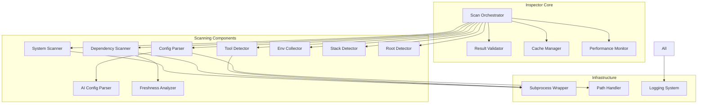
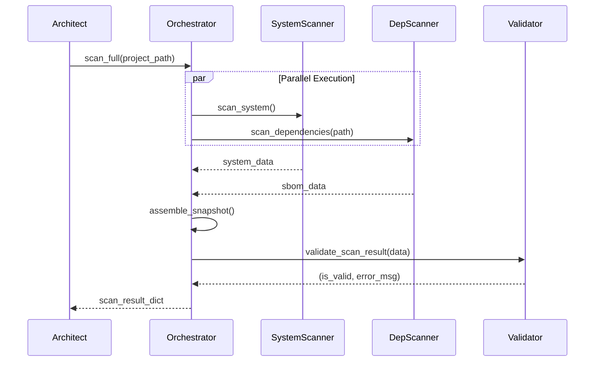

# Design Document: Inspector (Scanning & Intelligence)

## Overview

The Inspector is the scanning and intelligence component of DevReady CLI, responsible for collecting comprehensive system state, dependency information, and configuration data. It operates as a pure data collection layer that feeds The Architect's API with accurate, structured environment information through Python wrappers around industry-standard tools.

The Inspector is designed for speed (< 8 second full scans), reliability (100% offline operation), and accuracy (returns dictionaries matching The Architect's Pydantic schemas). It orchestrates multiple scanning components in parallel, handles errors gracefully, and provides partial results when individual scanners fail.

Key design principles:
- **Performance**: Parallel execution, caching, subprocess timeouts
- **Reliability**: Graceful degradation, comprehensive error handling, partial results
- **Accuracy**: Schema validation, type safety, structured output
- **Maintainability**: Clear separation of concerns, testable components, extensive logging

The Inspector integrates with:
- **osquery-python**: System-level state queries (installed tools, processes, ports)
- **syft**: SBOM generation for project dependencies
- **Custom parsers**: AI agent configuration files (CLAUDE.md, .cursorrules)
- **Checkov**: Policy validation and compliance checking

## Architecture

### System Context

```mermaid
graph TB
    Architect[The Architect API<br/>FastAPI Daemon]
    
    Inspector[Inspector Module<br/>Scan Orchestrator]
    
    SystemScanner[System Scanner<br/>osquery-python]
    DepScanner[Dependency Scanner<br/>syft subprocess]
    ConfigParser[Config Parser<br/>Custom parsers]
    PolicyChecker[Policy Checker<br/>Checkov integration]
    
    OSQuery[osquery<br/>System queries]
    Syft[syft CLI<br/>SBOM generation]
    
    Architect -->|Calls scan()| Inspector
    Inspector -->|Orchestrates| SystemScanner
    Inspector -->|Orchestrates| DepScanner
    Inspector -->|Orchestrates| ConfigParser
    Inspector -->|Validates with| PolicyChecker
    
    SystemScanner -->|Queries via Python| OSQuery
    DepScanner -->|Executes subprocess| Syft
    
    Inspector -->|Returns dict| Architect
    
    style Inspector fill:#e1f5ff
    style Architect fill:#fff4e1
```

### Component Architecture



### Technology Stack

- **Core Language**: Python 3.11+
- **System Queries**: osquery-python 3.0+ (Python bindings for osquery)
- **SBOM Generation**: syft CLI (executed as subprocess)
- **Policy Validation**: Checkov 3.0+ (Python library)
- **Data Validation**: Pydantic 2.6+ (schema validation, type safety)
- **Async Execution**: asyncio (parallel scanner execution)
- **Path Handling**: pathlib (cross-platform path operations)
- **Subprocess Management**: subprocess module with timeout support
- **Caching**: In-memory LRU cache with TTL
- **Logging**: Python logging module

### Execution Model

The Inspector operates in two modes:

**1. Full Scan Mode** (default):
- Executes all scanners in parallel using asyncio
- Assembles complete EnvironmentSnapshot
- Target: < 8 seconds total duration

**2. Incremental Scan Mode**:
- Executes only requested scanners
- Returns partial results
- Target: < 3 seconds for targeted scans

**Parallel Execution Strategy**:
```python
async def scan_full(project_path: Optional[str] = None) -> Dict[str, Any]:
    # Execute independent scanners in parallel
    results = await asyncio.gather(
        scan_system(),           # 2 seconds
        scan_dependencies(path), # 4 seconds
        scan_configs(path),      # 1 second
        scan_tools(),            # 3 seconds
        scan_env_vars(),         # 0.5 seconds
        return_exceptions=True   # Don't fail entire scan if one fails
    )
    # Assemble and validate results
    return assemble_snapshot(results)
```

## Components and Interfaces

### 1. Scan Orchestrator

**Responsibility**: Coordinate all scanning components, assemble results, handle errors

**Public Interface**:
```python
async def scan_full(
    project_path: Optional[str] = None,
    force_refresh: bool = False
) -> Dict[str, Any]:
    """
    Execute full environment scan.
    
    Args:
        project_path: Override automatic project detection
        force_refresh: Bypass caches
        
    Returns:
        Dictionary matching EnvironmentSnapshot schema
        
    Raises:
        ScanError: If all scanners fail
    """


async def scan_incremental(
    scope: Literal["system_only", "dependencies_only", "configs_only"],
    project_path: Optional[str] = None
) -> Dict[str, Any]:
    """
    Execute targeted scan of specific components.
    
    Args:
        scope: Which scanners to execute
        project_path: Override automatic project detection
        
    Returns:
        Partial dictionary with only requested data
    """
```

**Implementation Details**:
- Uses asyncio.gather() for parallel execution
- Collects timing data for each scanner
- Handles individual scanner failures gracefully
- Validates final result against EnvironmentSnapshot schema
- Includes error list in result if any scanner fails

**Error Handling**:
- If all scanners fail: Raise ScanError with details
- If some scanners fail: Return partial results with errors list
- If validation fails: Log error and return raw data with validation_failed flag

### 2. System Scanner (osquery-python wrapper)

**Responsibility**: Query OS-level state using osquery

**Public Interface**:
```python
async def scan_system() -> Dict[str, Any]:
    """
    Query system state using osquery.
    
    Returns:
        {
            "os_version": str,
            "architecture": str,
            "listening_ports": List[Dict],
            "installed_packages": List[Dict]
        }
    """
```


**osquery Queries**:
```python
# OS version and architecture
SELECT version, arch FROM os_version;

# Listening network ports
SELECT port, process_name, pid FROM listening_ports;

# Installed packages (varies by OS)
# macOS: SELECT name, version, source FROM homebrew_packages;
# Linux: SELECT name, version, source FROM deb_packages;
# Windows: SELECT name, version FROM programs;
```

**Package Manager Detection**:
- macOS: brew (Homebrew)
- Linux: apt, yum, dnf, pacman
- Windows: chocolatey, winget, scoop

**Performance Target**: < 2 seconds

**Error Handling**:
- If osquery not available: Log error, return empty result
- If query fails: Log error with query details, continue with other queries
- If query times out (> 5 seconds): Kill query, log timeout

### 3. Dependency Scanner (syft wrapper)

**Responsibility**: Generate SBOM using syft subprocess

**Public Interface**:
```python
async def scan_dependencies(project_path: str) -> Dict[str, Any]:
    """
    Generate SBOM for project using syft.
    
    Args:
        project_path: Root directory to scan
        
    Returns:
        {
            "artifacts": List[Dict],  # Parsed from syft JSON
            "sbom_format": str,
            "scan_duration": float
        }
    """
```


**syft Execution**:
```python
# Command: syft scan dir:{project_path} -o json
result = await subprocess_wrapper.execute(
    ["syft", "scan", f"dir:{project_path}", "-o", "json"],
    timeout=10.0
)
```

**SBOM Parsing**:
- Parse syft's JSON output
- Extract: package name, version, type (npm, pip, cargo, etc.), location
- Support ecosystems: npm, pip, cargo, go modules, maven, gradle

**Performance Target**: < 4 seconds for typical projects

**Error Handling**:
- If syft not installed: Return error with installation instructions
- If syft fails: Capture stderr, return in error details
- If output malformed: Log parsing error, return raw output

**Caching Strategy**:
- Cache SBOM results for 1 minute per project
- Invalidate cache if project files modified (check mtime)
- Cache key: (project_path, max_mtime_of_manifests)

### 4. Config Parser

**Responsibility**: Parse AI agent configuration files

**Public Interface**:
```python
async def scan_configs(project_path: str) -> List[Dict[str, Any]]:
    """
    Find and parse AI agent config files.
    
    Args:
        project_path: Root directory to search
        
    Returns:
        List of config dictionaries, one per file found
    """
```


**Supported Config Files**:
- `CLAUDE.md`: Markdown format, extract sections
- `.cursorrules`: JSON or YAML format
- `.copilot`: JSON format
- `AGENTS.md`: Markdown format
- `.aider.conf.yml`: YAML format

**Parsing Strategy**:
```python
def parse_claude_md(content: str) -> Dict:
    # Extract markdown sections as structured data
    # Identify: custom instructions, system prompts, tool configs
    # Extract: referenced file paths, API endpoints, dependencies
    pass

def parse_cursorrules(content: str) -> Dict:
    # Try JSON first, fall back to YAML
    # Normalize to common schema
    # Extract: model preferences, parameters (temperature, max_tokens)
    pass
```

**Merge Strategy**:
- If multiple configs exist, parse all
- .cursorrules takes precedence over CLAUDE.md for overlapping settings
- Return list of all configs with precedence order

**Error Handling**:
- If no configs found: Return empty list
- If parsing fails: Log error, include raw content in result
- If file unreadable: Log error, skip file

### 5. Tool Detector

**Responsibility**: Detect installed development tools and their versions

**Public Interface**:
```python
async def detect_tools() -> List[Dict[str, Any]]:
    """
    Detect common development tools and their versions.
    
    Returns:
        List of ToolVersion dictionaries
    """
```


**Tool Detection Strategy**:
```python
TOOLS_TO_DETECT = [
    ("node", ["node", "--version"]),
    ("python", ["python", "--version"]),
    ("go", ["go", "version"]),
    ("rustc", ["rustc", "--version"]),
    ("java", ["java", "-version"]),
    ("docker", ["docker", "--version"]),
    ("git", ["git", "--version"]),
]

async def detect_tool(name: str, cmd: List[str]) -> Optional[ToolVersion]:
    result = await subprocess_wrapper.execute(cmd, timeout=1.0)
    if result.exit_code == 0:
        version = parse_version_from_output(result.stdout)
        path = shutil.which(name)
        manager = detect_version_manager(name, path)
        return ToolVersion(name=name, version=version, path=path, manager=manager)
    return None
```

**Version Manager Detection**:
- nvm: Check if path contains `.nvm/`
- pyenv: Check if path contains `.pyenv/`
- asdf: Check if path contains `.asdf/`
- mise: Check if path contains `.mise/` or `.local/share/mise/`
- rustup: Check if path contains `.rustup/`
- sdkman: Check if path contains `.sdkman/`

**Performance Target**: < 3 seconds (parallel execution with 1-second timeout per tool)

**Caching Strategy**:
- Cache tool versions for 5 minutes
- Cache key: tool_name
- Invalidate on force_refresh

### 6. Environment Variable Collector

**Responsibility**: Collect and filter relevant environment variables

**Public Interface**:
```python
def collect_env_vars() -> Dict[str, str]:
    """
    Collect development-relevant environment variables.
    
    Returns:
        Dictionary of variable names to values (sensitive values redacted)
    """
```


**Filtering Strategy**:
```python
RELEVANT_VARS = [
    "PATH", "NODE_ENV", "PYTHON_PATH", "PYTHONPATH",
    "GOPATH", "GOROOT", "CARGO_HOME", "RUSTUP_HOME",
    "JAVA_HOME", "MAVEN_HOME", "GRADLE_HOME"
]

SENSITIVE_PATTERNS = [
    "token", "key", "secret", "password", "api",
    "auth", "credential", "private"
]

def is_sensitive(var_name: str) -> bool:
    return any(pattern in var_name.lower() for pattern in SENSITIVE_PATTERNS)

def collect_env_vars() -> Dict[str, str]:
    result = {}
    for var in RELEVANT_VARS:
        if var in os.environ:
            result[var] = os.environ[var]
    
    # Also check for sensitive vars to redact
    for var, value in os.environ.items():
        if var in result:
            continue
        if is_sensitive(var):
            result[var] = "[REDACTED]"
    
    return result
```

**.env File Parsing**:
```python
def parse_dotenv(project_path: str) -> Dict[str, str]:
    dotenv_path = Path(project_path) / ".env"
    if not dotenv_path.exists():
        return {}
    
    result = {}
    for line in dotenv_path.read_text().splitlines():
        line = line.strip()
        if not line or line.startswith("#"):
            continue
        if "=" not in line:
            logger.warning(f"Malformed .env line: {line}")
            continue
        key, value = line.split("=", 1)
        if is_sensitive(key):
            result[key] = "[REDACTED]"
        else:
            result[key] = value
    
    return result
```

**Security**: Never log or return actual sensitive values

### 7. Project Root Detector

**Responsibility**: Automatically detect project root directory

**Public Interface**:
```python
def detect_project_root(start_path: Optional[str] = None) -> Tuple[str, str]:
    """
    Detect project root and extract project name.
    
    Args:
        start_path: Starting directory (defaults to cwd)
        
    Returns:
        (project_root_path, project_name)
    """
```


**Detection Strategy**:
```python
PROJECT_MARKERS = [
    ".git",           # Priority 1: Git repository
    "package.json",   # Node.js
    "pyproject.toml", # Python
    "Cargo.toml",     # Rust
    "go.mod",         # Go
    "pom.xml",        # Java (Maven)
    "build.gradle",   # Java (Gradle)
]

def detect_project_root(start_path: Optional[str] = None) -> Tuple[str, str]:
    current = Path(start_path or os.getcwd()).resolve()
    
    # Traverse up to 10 parent directories
    for _ in range(10):
        for marker in PROJECT_MARKERS:
            if (current / marker).exists():
                project_name = extract_project_name(current, marker)
                return str(current), project_name
        
        if current.parent == current:  # Reached filesystem root
            break
        current = current.parent
    
    # Fallback: use start_path
    return str(Path(start_path or os.getcwd()).resolve()), Path.cwd().name

def extract_project_name(root: Path, marker: str) -> str:
    # Try to extract from manifest
    if marker == "package.json":
        data = json.loads((root / marker).read_text())
        return data.get("name", root.name)
    elif marker == "pyproject.toml":
        data = toml.loads((root / marker).read_text())
        return data.get("project", {}).get("name", root.name)
    elif marker == "Cargo.toml":
        data = toml.loads((root / marker).read_text())
        return data.get("package", {}).get("name", root.name)
    
    # Fallback: directory name
    return root.name
```

**Performance Target**: < 100ms

### 8. Tech Stack Detector

**Responsibility**: Identify programming language ecosystem

**Public Interface**:
```python
def detect_tech_stack(project_path: str) -> List[str]:
    """
    Identify tech stacks present in project.
    
    Args:
        project_path: Project root directory
        
    Returns:
        List of detected stacks (e.g., ["nodejs", "python"])
    """
```


**Detection Rules**:
```python
STACK_MARKERS = {
    "nodejs": ["package.json", "node_modules"],
    "python": ["pyproject.toml", "setup.py", "requirements.txt", "Pipfile"],
    "go": ["go.mod", "go.sum"],
    "rust": ["Cargo.toml", "Cargo.lock"],
    "java": ["pom.xml", "build.gradle", "build.gradle.kts"],
}

def detect_tech_stack(project_path: str) -> List[str]:
    root = Path(project_path)
    detected = []
    
    for stack, markers in STACK_MARKERS.items():
        if any((root / marker).exists() for marker in markers):
            detected.append(stack)
    
    return detected if detected else ["unknown"]
```

**Monorepo Support**: Returns multiple stacks if multiple markers found

### 9. Policy Checker (Checkov integration)

**Responsibility**: Validate scan results against team policies

**Public Interface**:
```python
def check_policy(
    scan_result: Dict[str, Any],
    team_policy: Dict[str, Any]
) -> List[Dict[str, Any]]:
    """
    Validate scan results against team policy.
    
    Args:
        scan_result: Output from scan_full()
        team_policy: Team policy definition
        
    Returns:
        List of policy violations
    """
```


**Validation Checks**:
```python
def check_policy(scan_result: Dict, team_policy: Dict) -> List[Dict]:
    violations = []
    
    # Check required tools
    for required in team_policy.get("required_tools", []):
        if not tool_present(scan_result["tools"], required["name"]):
            violations.append({
                "rule_id": "MISSING_REQUIRED_TOOL",
                "severity": "error",
                "message": f"Required tool {required['name']} not found",
                "affected_component": required["name"]
            })
    
    # Check version constraints
    for tool in scan_result["tools"]:
        constraint = team_policy.get("version_constraints", {}).get(tool["name"])
        if constraint and not version_satisfies(tool["version"], constraint):
            violations.append({
                "rule_id": "VERSION_MISMATCH",
                "severity": "warning",
                "message": f"{tool['name']} version {tool['version']} does not satisfy {constraint}",
                "affected_component": tool["name"]
            })
    
    # Check forbidden tools
    for tool in scan_result["tools"]:
        if tool["name"] in team_policy.get("forbidden_tools", []):
            violations.append({
                "rule_id": "FORBIDDEN_TOOL",
                "severity": "error",
                "message": f"Forbidden tool {tool['name']} detected",
                "affected_component": tool["name"]
            })
    
    # Check for CVEs in dependencies (using Checkov or vulnerability DB)
    # ... CVE checking logic ...
    
    return violations
```

### 10. Subprocess Wrapper

**Responsibility**: Safe subprocess execution with timeout and error handling

**Public Interface**:
```python
@dataclass
class SubprocessResult:
    exit_code: int
    stdout: str
    stderr: str
    duration_seconds: float
    timed_out: bool

async def execute(
    cmd: List[str],
    timeout: float = 5.0,
    cwd: Optional[str] = None
) -> SubprocessResult:
    """
    Execute command with timeout and capture output.
    
    Args:
        cmd: Command and arguments
        timeout: Timeout in seconds
        cwd: Working directory
        
    Returns:
        SubprocessResult with exit code and output
    """
```


**Implementation**:
```python
async def execute(cmd: List[str], timeout: float = 5.0, cwd: Optional[str] = None) -> SubprocessResult:
    # Sanitize command arguments
    sanitized_cmd = [str(arg) for arg in cmd]
    
    # Log command execution
    logger.debug(f"Executing: {' '.join(sanitized_cmd)}")
    
    start_time = time.time()
    timed_out = False
    
    try:
        process = await asyncio.create_subprocess_exec(
            *sanitized_cmd,
            stdout=asyncio.subprocess.PIPE,
            stderr=asyncio.subprocess.PIPE,
            cwd=cwd
        )
        
        stdout, stderr = await asyncio.wait_for(
            process.communicate(),
            timeout=timeout
        )
        
        exit_code = process.returncode
        
    except asyncio.TimeoutError:
        process.kill()
        await process.wait()
        stdout, stderr = b"", b"Command timed out"
        exit_code = -1
        timed_out = True
    
    duration = time.time() - start_time
    
    return SubprocessResult(
        exit_code=exit_code,
        stdout=stdout.decode("utf-8", errors="replace"),
        stderr=stderr.decode("utf-8", errors="replace"),
        duration_seconds=duration,
        timed_out=timed_out
    )
```

**Security**: Sanitizes arguments to prevent shell injection

### 11. Result Validator

**Responsibility**: Validate scan results against The Architect's schemas

**Public Interface**:
```python
def validate_scan_result(data: Dict[str, Any]) -> Tuple[bool, Optional[str]]:
    """
    Validate scan result against EnvironmentSnapshot schema.
    
    Args:
        data: Scan result dictionary
        
    Returns:
        (is_valid, error_message)
    """
```


**Implementation**:
```python
from pydantic import ValidationError

def validate_scan_result(data: Dict[str, Any]) -> Tuple[bool, Optional[str]]:
    try:
        # Import EnvironmentSnapshot from The Architect
        from architect.models import EnvironmentSnapshot
        
        # Attempt validation
        EnvironmentSnapshot(**data)
        return True, None
        
    except ValidationError as e:
        error_msg = f"Validation failed: {e.error_count()} errors\n"
        for error in e.errors():
            field = ".".join(str(loc) for loc in error["loc"])
            error_msg += f"  - {field}: {error['msg']}\n"
        return False, error_msg
    
    except Exception as e:
        return False, f"Unexpected validation error: {str(e)}"
```

### 12. Cache Manager

**Responsibility**: Cache expensive operations for performance

**Public Interface**:
```python
class CacheManager:
    def get(self, key: str) -> Optional[Any]:
        """Get cached value if not expired."""
        
    def set(self, key: str, value: Any, ttl_seconds: int):
        """Cache value with TTL."""
        
    def invalidate(self, key: str):
        """Remove cached value."""
        
    def clear(self):
        """Clear all caches."""
```

**Cache Configuration**:
- Tool versions: 5 minutes TTL
- SBOM results: 1 minute TTL
- Project root detection: No expiration (path-based)

**Implementation**: In-memory dictionary with expiration timestamps

### 13. Performance Monitor

**Responsibility**: Track scanner execution times and resource usage

**Public Interface**:
```python
class PerformanceMonitor:
    def start_timer(self, component: str):
        """Start timing a component."""
        
    def stop_timer(self, component: str) -> float:
        """Stop timer and return duration."""
        
    def get_metrics(self) -> Dict[str, Any]:
        """Get all timing metrics."""
```


**Metrics Collected**:
- Per-component execution time
- Total scan duration
- Cache hit/miss rates
- Number of subprocess executions
- Memory usage (optional)

**Performance Warnings**:
- Log warning if any component exceeds its time budget
- Log warning if total scan exceeds 8 seconds

### 14. Path Handler

**Responsibility**: Cross-platform path operations

**Public Interface**:
```python
class PathHandler:
    @staticmethod
    def normalize(path: str) -> str:
        """Normalize path to use forward slashes."""
        
    @staticmethod
    def expand_home(path: str) -> str:
        """Expand ~ to home directory."""
        
    @staticmethod
    def resolve_symlinks(path: str) -> str:
        """Resolve symlinks to actual targets."""
        
    @staticmethod
    def validate_exists(path: str) -> bool:
        """Check if path exists."""
```

**Implementation**: Uses pathlib for all operations

### 15. Freshness Analyzer

**Responsibility**: Analyze dependency freshness and identify outdated packages

**Public Interface**:
```python
def analyze_freshness(
    dependencies: Dict[str, List[str]],
    use_cache: bool = True
) -> Dict[str, Any]:
    """
    Analyze dependency freshness.
    
    Args:
        dependencies: Dict of ecosystem -> list of "name@version"
        use_cache: Use cached version data
        
    Returns:
        {
            "freshness_score": int,  # 0-100
            "outdated": List[Dict],
            "deprecated": List[Dict],
            "vulnerable": List[Dict]
        }
    """
```

**Analysis Strategy**:
- Compare versions against latest stable (from cache or registry)
- Categorize: current, minor_update_available, major_update_available, deprecated
- Check for known CVEs (using vulnerability database)
- Calculate freshness score based on update recency

**Offline Operation**: Uses cached data when offline, marks results as potentially stale

## Data Models

### Core Data Structures

**ToolVersion** (matches The Architect's schema):
```python
@dataclass(frozen=True)
class ToolVersion:
    name: str
    version: str
    path: str
    manager: Optional[str] = None
```


**ScanResult** (matches The Architect's EnvironmentSnapshot):
```python
{
    "timestamp": "2026-04-08T10:30:00Z",  # ISO 8601
    "project_path": "/path/to/project",
    "project_name": "my-project",
    "tech_stack": ["nodejs", "python"],
    "tools": [
        {
            "name": "node",
            "version": "20.11.0",
            "path": "/usr/local/bin/node",
            "manager": "nvm"
        }
    ],
    "dependencies": {
        "npm": ["express@4.18.0", "react@18.2.0"],
        "pip": ["fastapi@0.110.0", "pydantic@2.6.0"]
    },
    "env_vars": {
        "NODE_ENV": "development",
        "PYTHON_PATH": "/usr/local/lib/python3.11",
        "API_KEY": "[REDACTED]"
    },
    "ai_configs": [
        {
            "file_path": "/path/to/project/CLAUDE.md",
            "agent_type": "claude",
            "settings": {...},
            "dependencies": [],
            "last_modified": "2026-04-01T12:00:00Z"
        }
    ],
    "scan_duration_seconds": 6.2,
    "errors": []  # Empty if no errors
}
```

**PolicyViolation**:
```python
{
    "rule_id": "MISSING_REQUIRED_TOOL",
    "severity": "error",  # or "warning"
    "message": "Required tool python not found",
    "affected_component": "python"
}
```

**AIConfig**:
```python
{
    "file_path": str,
    "agent_type": str,  # "claude", "cursor", "copilot", "aider"
    "settings": Dict[str, Any],
    "dependencies": List[str],
    "last_modified": str  # ISO 8601
}
```

### Data Flow



## Correctness Properties

*A property is a characteristic or behavior that should hold true across all valid executions of a system—essentially, a formal statement about what the system should do. Properties serve as the bridge between human-readable specifications and machine-verifiable correctness guarantees.*


### Property Reflection

After analyzing all acceptance criteria, I've identified several areas where properties can be consolidated:

**Redundancy Analysis**:
1. **Tool/Config Structure Properties**: Requirements 1.2, 1.4, 2.4, 3.5, 6.6, 12.3, 15.4 all test that returned data contains required fields. These can be combined into comprehensive structure validation properties.

2. **Stack Detection Properties**: Requirements 5.1-5.5 all follow the same pattern (marker present → stack detected). These can be combined into a single property about marker-based detection.

3. **Error Handling Properties**: Requirements 1.8, 3.8, 8.6, 15.3 all test that errors don't crash the system. These can be combined into a general error resilience property.

4. **Logging Properties**: Requirements 19.1-19.4 all test logging behavior. These can be combined into comprehensive logging properties.

5. **Performance Properties**: Requirements 1.6, 2.6, 4.7, 7.4, 9.6, 10.7, 14.5 all test timing. These can be kept separate as they test different components.

6. **Validation Properties**: Requirements 13.1-13.7 all relate to result validation and can be consolidated.

**Consolidated Property Set**:
After reflection, I've reduced ~80 testable criteria to ~45 unique properties by:
- Combining structure validation properties
- Merging similar detection logic properties
- Consolidating error handling properties
- Grouping related logging properties
- Keeping performance properties separate (different components)

### Property 1: System Scanner Returns Required Fields

*For any* system scan result, all tool entries should contain the required fields: name, version, path, and manager (which may be null).

**Validates: Requirements 1.2**

### Property 2: System Scanner Includes OS Information

*For any* system scan result, the result should include os_version and architecture fields.

**Validates: Requirements 1.5**

### Property 3: System Scanner Port Data Structure

*For any* listening port entry in a system scan result, the entry should contain port number, process name, and PID.

**Validates: Requirements 1.4**
