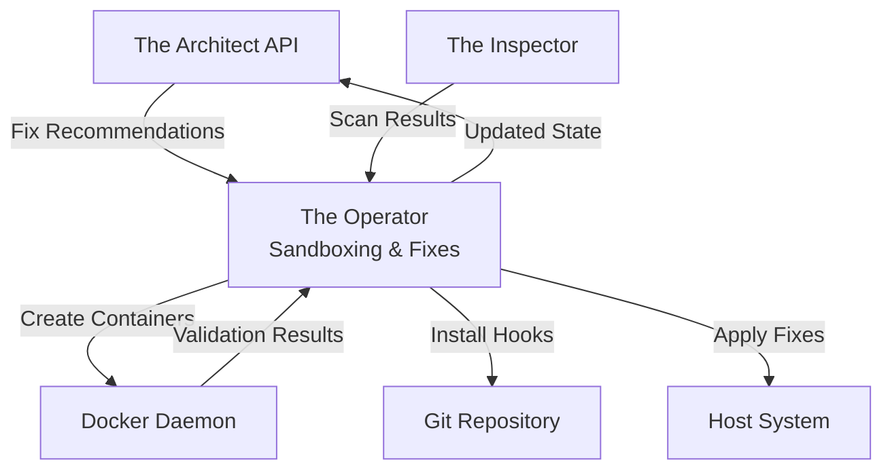
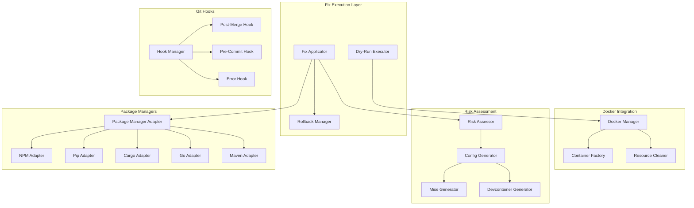

# Design Document: Sandboxing & Fixes (Operator)

## Overview

The Operator component is the sandboxing and fix execution layer of DevReady, responsible for safely applying environment fixes without breaking existing projects. It uses Docker containers as isolated sandboxes to validate fixes before applying them to the host system, ensuring strict project isolation and preventing the classic "fixing one project breaks another" problem.

This component is implemented using python-on-whales for Docker integration, GitPython for git hook management, and includes intelligent fallback logic to generate project-specific isolation configs (mise.toml, devcontainer.json) when global fixes are deemed unsafe. The Operator completes dry-run validations in under 10 seconds per fix and supports multiple package managers across diverse tech stacks.

The architecture prioritizes:
- **Safety**: All fixes validated in sandboxes before host application
- **Isolation**: Guarantees that fixes never affect other projects
- **Intelligence**: Automatic risk assessment and fallback strategies
- **Performance**: Fast validation with concurrent execution support

## Architecture

### System Context



### Component Architecture



### Technology Stack

- **Docker Integration**: python-on-whales 0.70+ (Pythonic Docker API)
- **Git Integration**: GitPython 3.1+ (Git repository manipulation)
- **Subprocess Management**: Python subprocess + sh 2.0+ (command execution)
- **Config Generation**: TOML 0.10+, JSON (mise.toml, devcontainer.json)
- **Platform Detection**: platform, os, pathlib (cross-platform support)
- **Performance Monitoring**: time, psutil (execution timing)

### Deployment Model

The Operator runs as part of the DevReady daemon:
- Invoked by The Architect when fixes are needed
- Creates ephemeral Docker containers for validation
- Applies verified fixes to the host system
- Installs git hooks in project repositories
- Generates isolation configs when needed

## Components and Interfaces

### 1. Docker Manager

**Responsibility**: Manage Docker containers for fix validation

**Key Classes**:
- `DockerManager`: Main interface for Docker operations
- `ContainerFactory`: Creates containers with appropriate base images
- `ResourceCleaner`: Cleans up containers, images, volumes

**Docker Image Selection**:
```python
TECH_STACK_IMAGES = {
    "nodejs": "node:lts-alpine",
    "python": "python:3.11-slim",
    "go": "golang:1.21-alpine",
    "rust": "rust:1.75-slim",
    "java": "eclipse-temurin:17-jdk-alpine",
}
```

**Container Configuration**:
```python
container = docker.run(
    image=TECH_STACK_IMAGES[tech_stack],
    volumes=[(project_root, "/workspace")],
    working_dir="/workspace",
    remove=True,  # Auto-remove after execution
    detach=False,
    command=fix_command
)
```

**Key Methods**:
- `verify_docker_available() -> bool`: Check Docker is installed and running
- `create_sandbox(tech_stack: str, project_root: Path) -> Container`: Create ephemeral container
- `execute_fix(container: Container, command: str, timeout: int) -> ExecutionResult`: Run fix in container
- `cleanup_resources() -> None`: Remove orphaned containers and images

### 2. Fix Execution Layer

**DryRunExecutor**:
- Executes fixes in sandbox containers
- Captures stdout, stderr, exit codes
- Returns validation results

**FixApplicator**:
- Applies verified fixes to host system
- Requires user confirmation for global fixes
- Logs all applied fixes
- Triggers post-fix scans

**RollbackManager**:
- Creates snapshots before global fixes
- Restores previous state on failure
- Maintains last 5 snapshots
- Provides manual rollback command

**Execution Flow**:
```python
# Dry-run phase
result = dry_run_executor.execute(fix_command, project_root, tech_stack)
if not result.success:
    return FixResult(verified=False, error=result.stderr)

# Application phase (with confirmation for global fixes)
if risk_assessor.is_global_fix(fix_command):
    if not user_confirms():
        return FixResult(skipped=True, reason="User declined")
    rollback_manager.create_snapshot()

host_result = fix_applicator.apply_to_host(fix_command)
if not host_result.success:
    rollback_manager.restore_snapshot()
    return FixResult(failed=True, rolled_back=True)

# Verification phase
verification = fix_verifier.verify(project_root)
return FixResult(success=True, verification=verification)
```

### 3. Risk Assessment and Isolation

**RiskAssessor**:
- Classifies fixes as Global or Local
- Assigns risk levels: low, medium, high
- Recommends isolation strategies

**Classification Logic**:
```python
def classify_fix(command: str) -> FixType:
    global_patterns = [
        r"brew install",
        r"apt(-get)? install",
        r"choco install",
        r"nvm install",
        r"pyenv install",
        r"rustup install",
    ]
    
    if any(re.search(pattern, command) for pattern in global_patterns):
        return FixType.GLOBAL
    return FixType.LOCAL

def assess_risk(fix_type: FixType, conflicts: List[Project]) -> RiskLevel:
    if fix_type == FixType.LOCAL:
        return RiskLevel.LOW
    if conflicts:
        return RiskLevel.HIGH
    return RiskLevel.MEDIUM
```

**ConfigGenerator**:
- Generates mise.toml for tool version isolation
- Generates devcontainer.json for full environment isolation
- Merges with existing configs
- Validates generated configs

**mise.toml Generation**:
```toml
# Generated by DevReady to isolate tool versions
# Install mise: https://mise.jdx.dev/getting-started.html

[tools]
node = "20.11.0"  # Required by package.json engines
python = "3.11.8"  # Required by .python-version

# This file ensures these tool versions are used only in this project
# Other projects on your system are unaffected
```

**devcontainer.json Generation**:
```json
{
  "name": "DevReady Isolated Environment",
  "image": "mcr.microsoft.com/devcontainers/typescript-node:20",
  "features": {
    "ghcr.io/devcontainers/features/python:1": {
      "version": "3.11"
    },
    "ghcr.io/devcontainers/features/docker-in-docker:2": {}
  },
  "forwardPorts": [3000, 8000, 8080, 5173],
  "postCreateCommand": "npm install",
  "mounts": [
    "source=${localWorkspaceFolder}/node_modules,target=${containerWorkspaceFolder}/node_modules,type=bind,consistency=cached"
  ]
}
```

### 4. Git Hook Management

**HookManager**:
- Installs hooks in .git/hooks directory
- Preserves existing hooks by chaining
- Makes hooks executable on Unix systems
- Handles Windows hook execution

**Hook Installation**:
```python
def install_post_merge_hook(repo_path: Path):
    hook_path = repo_path / ".git" / "hooks" / "post-merge"
    
    # Preserve existing hook
    existing_content = ""
    if hook_path.exists():
        existing_content = hook_path.read_text()
    
    # Add DevReady hook
    hook_content = f"""#!/bin/sh
# DevReady post-merge hook
devready scan --quick

# Existing hook content
{existing_content}
"""
    
    hook_path.write_text(hook_content)
    hook_path.chmod(0o755)  # Make executable
```

**PostMergeHook**:
- Triggers after `git pull` or `git merge`
- Detects changes to dependency files
- Runs quick or full scan based on changes
- Offers to run `devready fix` if issues found

**PreCommitHook**:
- Validates environment before commits
- Checks required tools are installed
- Validates dependencies are installed
- Blocks commit if validation fails (unless --no-verify)

**ErrorHook**:
- Integrates with shell history
- Detects "command not found" errors
- Triggers focused scans for missing tools
- Offers automatic installation

### 5. Package Manager Adapters

**PackageManagerAdapter**:
- Detects which package manager a project uses
- Generates fix commands using detected manager
- Supports multiple managers per tech stack

**Detection Logic**:
```python
def detect_package_manager(project_root: Path, tech_stack: str) -> str:
    if tech_stack == "nodejs":
        if (project_root / "pnpm-lock.yaml").exists():
            return "pnpm"
        if (project_root / "yarn.lock").exists():
            return "yarn"
        if (project_root / "bun.lockb").exists():
            return "bun"
        return "npm"
    
    if tech_stack == "python":
        if (project_root / "poetry.lock").exists():
            return "poetry"
        if (project_root / "Pipfile.lock").exists():
            return "pipenv"
        return "pip"
    
    # ... similar logic for other stacks
```

**Supported Managers**:
- Node.js: npm, yarn, pnpm, bun
- Python: pip, poetry, pipenv
- Rust: cargo
- Go: go modules
- Java: maven, gradle

### 6. Fix Command Parser

**FixParser**:
- Parses fix command strings into structured data
- Extracts package manager, action, target, version
- Validates command syntax

**Parsing Logic**:
```python
@dataclass
class ParsedFixCommand:
    package_manager: str
    action: str  # install, update, remove, configure
    target: str  # package or tool name
    version: Optional[str] = None
    flags: List[str] = field(default_factory=list)

def parse_fix_command(command: str) -> ParsedFixCommand:
    # npm install react@18.2.0 --save-dev
    parts = command.split()
    
    return ParsedFixCommand(
        package_manager=parts[0],  # npm
        action=parts[1],  # install
        target=parts[2].split("@")[0],  # react
        version=parts[2].split("@")[1] if "@" in parts[2] else None,  # 18.2.0
        flags=parts[3:]  # [--save-dev]
    )
```

**PrettyPrinter**:
- Formats parsed commands into human-readable descriptions
- Includes risk level and isolation strategy
- Supports round-trip parsing validation

### 7. Concurrent Execution

**ConcurrentExecutor**:
- Identifies independent fixes that can run in parallel
- Executes up to 3 fixes concurrently
- Handles dependency chains sequentially
- Aggregates results from all executions

**Dependency Detection**:
```python
def are_independent(fix_a: Fix, fix_b: Fix) -> bool:
    # Fixes are independent if they target different tools/packages
    return fix_a.target != fix_b.target

def build_dependency_graph(fixes: List[Fix]) -> Dict[Fix, List[Fix]]:
    graph = {}
    for fix in fixes:
        dependencies = [f for f in fixes if f.target in fix.requires]
        graph[fix] = dependencies
    return graph

async def execute_concurrent(fixes: List[Fix]) -> List[FixResult]:
    graph = build_dependency_graph(fixes)
    results = []
    
    # Execute in topological order with parallelism
    while graph:
        # Find fixes with no dependencies
        ready = [f for f, deps in graph.items() if not deps]
        
        # Execute up to 3 in parallel
        batch = ready[:3]
        batch_results = await asyncio.gather(*[
            execute_fix(fix) for fix in batch
        ])
        
        results.extend(batch_results)
        
        # Remove completed fixes from graph
        for fix in batch:
            del graph[fix]
            for deps in graph.values():
                if fix in deps:
                    deps.remove(fix)
    
    return results
```

### 8. Platform Adaptation

**PlatformAdapter**:
- Detects host operating system
- Uses platform-specific package managers
- Handles path format differences
- Manages line ending differences

**Platform Detection**:
```python
import platform

def get_platform_info() -> PlatformInfo:
    system = platform.system()  # Darwin, Linux, Windows
    machine = platform.machine()  # x86_64, arm64, AMD64
    
    if system == "Darwin":
        return PlatformInfo(os="macos", package_manager="brew")
    elif system == "Linux":
        # Detect Linux distro
        if Path("/etc/debian_version").exists():
            return PlatformInfo(os="ubuntu", package_manager="apt")
        elif Path("/etc/redhat-release").exists():
            return PlatformInfo(os="rhel", package_manager="yum")
    elif system == "Windows":
        # Check for WSL2
        if "microsoft" in platform.release().lower():
            return PlatformInfo(os="wsl2", package_manager="apt")
        return PlatformInfo(os="windows", package_manager="choco")
    
    return PlatformInfo(os="unknown", package_manager=None)
```

**Path Handling**:
```python
def normalize_path(path: str) -> Path:
    # Convert to Path object
    p = Path(path).expanduser().resolve()
    
    # Handle Windows drive letters in Docker mounts
    if platform.system() == "Windows" and not is_wsl2():
        # C:\Users\... -> /c/Users/...
        drive = p.drive.rstrip(":")
        path_without_drive = str(p).replace(p.drive, "")
        return Path(f"/{drive.lower()}{path_without_drive.replace(os.sep, '/')}")
    
    return p
```

### 9. Performance Monitoring

**PerformanceMonitor**:
- Measures execution time for each fix
- Tracks sandbox vs host execution time
- Logs warnings for slow fixes
- Exports timing data in JSON format

**Timing Breakdown**:
```python
@dataclass
class FixTiming:
    container_startup_ms: float
    sandbox_execution_ms: float
    verification_ms: float
    host_execution_ms: float
    total_ms: float
    
    def is_within_budget(self) -> bool:
        return self.total_ms < 10000  # 10 seconds per fix
```

### 10. Error Handling and Recovery

**Error Categories**:
1. **Docker Errors**: Daemon not running, image pull failures
2. **Execution Errors**: Fix command failures, timeouts
3. **Filesystem Errors**: Permission denied, disk full
4. **Git Errors**: Not a git repository, hook installation failures

**Error Handling Strategy**:
```python
class OperatorError(Exception):
    """Base exception for Operator errors"""
    pass

class DockerNotAvailableError(OperatorError):
    """Docker is not installed or not running"""
    def __init__(self):
        super().__init__(
            "Docker is not available. Please install Docker and ensure it's running.\n"
            "macOS/Windows: https://www.docker.com/products/docker-desktop\n"
            "Linux: https://docs.docker.com/engine/install/"
        )

class FixExecutionError(OperatorError):
    """Fix command failed during execution"""
    def __init__(self, command: str, exit_code: int, stderr: str):
        super().__init__(
            f"Fix command failed: {command}\n"
            f"Exit code: {exit_code}\n"
            f"Error: {stderr}"
        )
```

**Recovery Logic**:
- Continue with remaining fixes if one fails
- Automatic rollback on host execution failure
- Provide troubleshooting guidance when all fixes fail
- Never crash due to individual fix failures

## Data Models

### Core Domain Models

**FixCommand** (Value Object):
```python
@dataclass(frozen=True)
class FixCommand:
    command: str
    package_manager: str
    action: str
    target: str
    version: Optional[str] = None
    risk_level: RiskLevel = RiskLevel.MEDIUM
```

**ExecutionResult** (Value Object):
```python
@dataclass
class ExecutionResult:
    success: bool
    exit_code: int
    stdout: str
    stderr: str
    duration_seconds: float
    timestamp: datetime
```

**FixResult** (Aggregate):
```python
@dataclass
class FixResult:
    fix_command: FixCommand
    dry_run_result: ExecutionResult
    host_result: Optional[ExecutionResult] = None
    verification: Optional[VerificationReport] = None
    rolled_back: bool = False
    skipped: bool = False
    error: Optional[str] = None
```

**RiskAssessment** (Value Object):
```python
@dataclass
class RiskAssessment:
    level: RiskLevel  # LOW, MEDIUM, HIGH
    fix_type: FixType  # GLOBAL, LOCAL
    conflicts: List[str]  # Conflicting projects
    isolation_recommended: bool
    reason: str
```

**IsolationConfig** (Value Object):
```python
@dataclass
class IsolationConfig:
    config_type: str  # "mise.toml", "devcontainer.json"
    content: str
    path: Path
    merge_required: bool
```

## Correctness Properties

### Property 1: Sandbox Isolation
**Statement**: Fixes executed in sandbox containers never affect the host system until explicitly applied.
**Validation**: Test that failed sandbox executions leave host unchanged.

### Property 2: Project Isolation
**Statement**: Fixes applied to one project never affect other projects on the system.
**Validation**: Test that global fixes with isolation configs don't break other projects.

### Property 3: Rollback Correctness
**Statement**: Rolling back a failed fix restores the exact previous state.
**Validation**: Test that rollback after failure returns system to pre-fix snapshot.

### Property 4: Fix Verification
**Statement**: Applied fixes are verified to actually resolve the reported issues.
**Validation**: Test that post-fix scans confirm issues are resolved.

### Property 5: Concurrent Execution Safety
**Statement**: Concurrent fix execution produces the same results as sequential execution.
**Validation**: Property test that concurrent and sequential execution are equivalent.

### Property 6: Risk Assessment Accuracy
**Statement**: Global fixes are correctly identified and flagged for user confirmation.
**Validation**: Test that all system-level commands are classified as global.

### Property 7: Hook Preservation
**Statement**: Installing DevReady hooks preserves existing git hooks.
**Validation**: Test that existing hook content is maintained after installation.

### Property 8: Platform Compatibility
**Statement**: Fixes work correctly on Windows, macOS, and Linux.
**Validation**: Test fix execution on all three platforms.

### Property 9: Timeout Enforcement
**Statement**: Fix commands that exceed timeout are terminated and reported as failures.
**Validation**: Test that long-running commands are killed after timeout.

### Property 10: Resource Cleanup
**Statement**: All Docker resources are cleaned up after fix execution.
**Validation**: Test that no orphaned containers or images remain after execution.

## Performance Requirements

- Container creation: < 3 seconds
- Fix execution in sandbox: < 10 seconds (typical)
- Fix application to host: < 5 seconds
- Rollback operation: < 3 seconds
- Hook installation: < 1 second
- Config generation: < 500ms
- Concurrent execution: Faster than sequential for 3+ independent fixes

## Security Considerations

- Sandbox containers run with minimal privileges
- Host filesystem mounted read-write only for project directory
- No network access in sandbox (unless explicitly required)
- User confirmation required for global fixes
- Rollback snapshots exclude sensitive data
- Git hooks run with user permissions only
- Generated configs validated before writing

## Testing Strategy

- Unit tests for each component
- Property tests for correctness properties
- Integration tests for end-to-end workflows
- Platform-specific tests for Windows/macOS/Linux
- Performance tests for timing requirements
- Security tests for isolation guarantees
